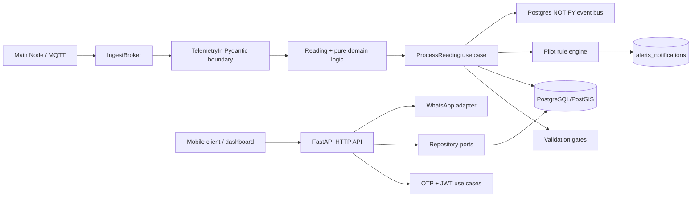
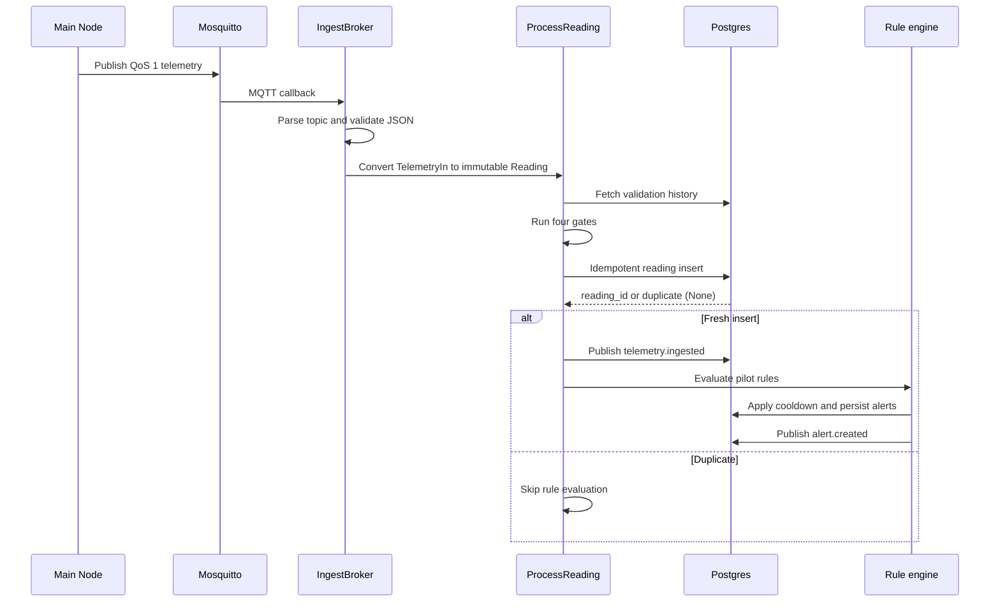

# AgroGuardian V2 codebase guide

This document describes the behavior implemented in the repository as it exists today. The code is the source of truth when this guide differs from an older roadmap or design note.

This is a current-checkout reference, not a promise that every planned
integration is live. The project began as a Windows-generated prototype and was
later copied to a Mac/VPS workflow. That history explains why the repository
contains both active code and future-phase seams. Start with:

1. [Configuration](CONFIGURATION.md) for every environment variable and the
   internal/public MQTT distinction.
2. [Complete file reference](FILE_REFERENCE.md) for every tracked file.
3. This guide for architecture and runtime behavior.
4. [Development and operations](DEVELOPMENT.md) before changing the VPS.

## Source-of-truth hierarchy

When two instructions disagree, use this order:

1. Running code and tests.
2. Alembic migrations for the deployed database schema.
3. `docker-compose.*.yml` and deployment configuration for container topology.
4. The current wire schema in `app/infra/mqtt/schemas.py`.
5. The documentation in this directory.
6. Older roadmap/bootstrap comments, which may describe work that was planned
   but never wired.

## 1. Product and implementation boundary

The backend is designed around this pilot scenario:

- one tenant and farmer-facing farm data model;
- a Main Node that aggregates Sub Node readings and publishes MQTT telemetry;
- Postgres/PostGIS as the system of record;
- deterministic validation and hot rules before any future notification or AI work;
- a FastAPI read API consumed by a Streamlit operations dashboard.

The following paths are implemented and wired into the running app:

| Capability | Current implementation |
| --- | --- |
| Health and metrics | FastAPI liveness endpoint, readiness response, Prometheus metrics |
| Farmer authentication | WhatsApp/log-only OTP, salted OTP hashes, HS256 access JWTs, rotating refresh sessions |
| Telemetry | MQTT v5 subscriber, JSON telemetry schema, Decimal-safe conversion, bounded async queue |
| Reading quality | Range, stuck, MAD outlier, and cross-sensor gates |
| Alert rules | Seven pilot rules with cooldown suppression and Marathi templates |
| Read API | Plots, recent readings, plot alerts, AI suggestions, tenant alert queue, resolve |
| Persistence | SQLAlchemy async repositories plus Alembic migrations through revision `0009` |
| Dashboard | Streamlit pages over the HTTP API; it does not access Postgres directly |
| Deployment | Development and production Docker Compose files, Caddy, Mosquitto, Prometheus, Grafana |

Several database tables and adapters are prepared for later phases but are not part of the live request/ingest path yet. In particular, weather, satellite, outbound alert dispatch, automatic Claude advisory generation, FCM, OTA, and an in-app dashboard login flow remain incomplete or scaffolded.

## 2. Runtime architecture

The application follows ports-and-adapters (hexagonal) structure:



### Layer responsibilities

| Layer | Location | Responsibility | Import rule |
| --- | --- | --- | --- |
| Domain | `app/domain/` | Immutable entities, enums, thresholds, validation math, metrics, rule evaluation | Standard library plus the project time helper; no framework or I/O |
| Application | `app/application/` | Use cases and dependency-inverted ports | Domain, ports, standard library; never infrastructure |
| Infrastructure | `app/infra/` | FastAPI routes, MQTT, SQLAlchemy repositories, JWT, WhatsApp, LLM, event bus | Implements application ports and owns external libraries |
| Configuration | `app/config.py` | Typed environment settings and production safety checks | Pydantic Settings |
| Composition | `app/main.py`, `app/jobs/ingest_startup.py` | App factory, lifespan, adapter construction, shutdown | Wires the layers together |

The application and domain purity tests enforce the important dependency direction. A new provider should normally be a new adapter plus a port implementation, not a direct provider import in a use case.

## 3. Application startup and shutdown

`app.main:app` is the module-level FastAPI instance used by Uvicorn and Docker.

During the lifespan startup sequence:

1. `configure_logging()` configures structured logging.
2. Settings are loaded from the environment and production defaults are rejected.
3. Sentry is initialized when `SENTRY_DSN` is set and the environment is not `test`.
4. `build_and_start_ingest()` constructs repository/event-bus adapters and starts `IngestBroker` when `MQTT_BROKER_HOST` is non-empty.
5. The app serves HTTP traffic while the broker's paho thread feeds the asyncio drain task.

On shutdown, the broker drain task is cancelled, the MQTT client disconnects, the shared SQLAlchemy engine is disposed, and a structured shutdown event is emitted.

The app exposes interactive Swagger/ReDoc only outside production. Production Caddy also hides the OpenAPI and docs paths.

## 4. Telemetry path

### 4.1 MQTT contract

The subscriber uses MQTT v5, QoS 1, a 60-second keepalive, and the filter:

```text
agro/v2/+/+/+/telemetry
```

The exact topic shape is:

```text
agro/v2/<tenant_id>/<farm_id>/<node_id>/telemetry
```

Only the `telemetry` kind is implemented by `parse_inbound()`. Well-formed `weather`, `heartbeat`, `alert`, or `health` topics are currently rejected as unknown kinds.

The payload must be JSON matching `$schema = "agro-guardian/telemetry/v2"`. Pydantic rejects unknown fields, missing required fields, invalid UUIDs, invalid enums, non-negative constraint violations, and timezone-naive timestamps. Numeric measurements are converted through `Decimal(str(value))` before they enter the domain.

The required payload identity/timing fields are `$schema`, `tenant_id`, `farmer_id`, `farm_id`, `plot_id`, `node_id`, `recorded_at`, `received_at_master`, and `transmission_type`. The rest of the sensor, battery, water, diagnostic, and validation fields are optional.

See [`HARDWARE_WIRE_CONTRACT.md`](HARDWARE_WIRE_CONTRACT.md) for the firmware-facing examples. That file should be kept aligned with `app/infra/mqtt/schemas.py`.

### 4.2 Thread-to-async bridge

Paho callbacks run on a background thread. `IngestBroker._on_message()` uses `loop.call_soon_threadsafe()` to place `(topic, payload)` into a bounded `asyncio.Queue` with capacity 5,000. The drain loop processes messages serially on the asyncio loop.

The queue is deliberately bounded. A full queue drops a message and increments `ingest_dropped_total{reason="queue_full"}` rather than blocking the MQTT callback thread.

### 4.3 Processing sequence



`PgReadingRepo.save()` uses `ON CONFLICT (node_id, recorded_at) DO NOTHING RETURNING reading_id`. A `None` result is a successful duplicate, not a processing failure. The duplicate path prevents a QoS-1 redelivery from creating duplicate alerts.

### 4.4 Drop and error classification

The drain loop catches errors per message so one bad packet cannot kill ingestion. The current metric reasons are:

| Reason | Typical cause |
| --- | --- |
| `topic_parse` | Topic is not exactly `agro/v2/<tenant>/<farm>/<node>/<kind>` |
| `unknown_topic_kind` | Topic kind is not the implemented `telemetry` kind |
| `validation` | Pydantic payload validation failed |
| `parse_error` | Invalid JSON or a boundary conversion `ValueError`/`KeyError` |
| `duplicate` | Reading uniqueness key already exists |
| `queue_full` | Async ingest queue reached capacity |
| `loop_closed` | MQTT callback raced with event-loop shutdown |
| `unexpected` | Infrastructure or programming failure not otherwise classified |

Structured logs identify the topic and error class, but logging helpers redact secrets and mask phone numbers.

## 5. Reading validation and domain behavior

`Reading` is a frozen dataclass. Validation returns the original instance when clean or a new instance with `validation_warn=True` and a merged `sensor_health_json` map.

The four gates run in deterministic order:

1. **Range:** physical bounds such as moisture 0–100, pH 0–14, soil temperature −10–80 °C, and battery percentage 0–100.
2. **Stuck:** at least four identical non-null values in the recent history plus the incoming value; the database window is 90 minutes.
3. **MAD outlier:** Hampel-style median absolute deviation with `k=3.5`; the database window is 24 hours and requires at least 12 samples.
4. **Cross-sensor:** moisture probes disagree by more than 15 percentage points, the firmware low-battery flag conflicts with voltage below 3.30 V, or the NPK/EC frame is incomplete.

Only one flag is retained per field. A later gate does not replace an earlier range/stuck/outlier flag. Existing firmware-provided health entries are merged with backend flags.

## 6. Metrics, pilot rules, and alert lifecycle

`app.domain.metrics.compute()` derives a small interpreted view from a reading. Important pilot constants include:

- target moisture: 28.0%;
- battery low: below 3.30 V or 20%;
- battery critical: at or below 3.10 V or 10%;
- battery dead: at or below 2.90 V;
- frost risk: root-zone soil temperature at or below 4 °C;
- dry-run signature: pump on, current at or below 0.5 A, and flow at or below 0.2 L/min.

The active `PILOT_RULESET` contains:

| Rule | Alert type | Severity | Cooldown |
| --- | --- | --- | ---: |
| `low_battery` | `low_battery` | warning | 12 h |
| `battery_critical` | `low_battery` | critical | 2 h |
| `low_water` | `low_water` | warning | 4 h |
| `dry_run` | `dry_run` | critical | 30 min |
| `sensor_fault` | `sensor_fault` | info | 6 h |
| `frost` | `frost` | warning | 4 h |
| `tamper` | `tamper` | critical | 1 h |

Cooldown lookup and alert persistence belong in `app/application/evaluate_rules.py`, not the pure rule engine. Rules sharing an alert type also share the repository cooldown lookup key `(plot_id, alert_type)`.

When `CALIBRATION_MODE=true`, reading persistence continues but rule evaluation returns zero hits without touching the alert repository or event bus. This is the intended hardware bench mode.

The event bus currently uses PostgreSQL `pg_notify`. Published event names include `telemetry.ingested` and `alert.created`; payloads contain IDs and small status fields rather than full domain objects.

Outbound alert dispatch is not wired into the current startup path. The database already contains dispatch status/log/DLQ structures for the later dispatcher phase.

## 7. HTTP API and authorization model

All route paths and request/response details are in [`API_REFERENCE.md`](API_REFERENCE.md). The short surface is:

- `/api/v1/health`, `/api/v1/ready`;
- `/api/v1/auth/send_otp`, `/verify_otp`, `/refresh`, `/logout`;
- `/api/v1/me`;
- `/api/v1/plots` and plot readings, alerts, and suggestions;
- `/api/v1/alerts` and `/alerts/{id}/resolve`;
- `/metrics`.

Farmer routes require a bearer access token. Plot list queries use the farmer subject; tenant-level alert queue queries use the tenant claim. Cross-tenant plot and alert lookups return a generic 404 to avoid leaking resource existence. See the known authorization note below for the current detail-route scope.

### Authentication flow

1. `send_otp` looks up the phone, refuses concurrent active challenges, applies the five-challenges-per-30-minute throttle, stores a salted hash, and sends via the configured WhatsApp port. Unknown phones still receive a 202-shaped response so the API does not become a phone-enumeration oracle.
2. `verify_otp` checks expiry, consumption, attempt count, and the hashed code. A successful verification consumes the challenge, creates an `auth_sessions` row containing only a SHA-256 refresh-token hash, and returns an access/refresh pair.
3. Access tokens are HS256 JWTs carrying subject, tenant, role, session ID, issuer, audience, issued-at, and expiry claims. Defaults are 15 minutes for access and 30 days for refresh.
4. `refresh` verifies the stored hash and session state, creates a new refresh session, revokes the old session, and issues a new access token.
5. `logout` revokes one refresh session or all sessions for the farmer.

Development/test uses `LogOnlyWhatsappSender`; production selects `MetaCloudWhatsappSender` only when production Meta credentials are present. The development sender writes the OTP to structured logs and must never be used as a production delivery mechanism.

## 8. Persistence and migrations

### Database technology

The stack uses PostGIS-backed PostgreSQL 15. SQLAlchemy uses an async `postgresql+asyncpg` DSN; Alembic uses a synchronous `postgresql` DSN. The shared async engine is created lazily by `app/infra/http/deps.py` and disposed during lifespan shutdown.

### Model families

The SQLAlchemy models cover these areas:

| Family | Tables |
| --- | --- |
| Tenant/core | `tenants`, `users`, legacy `otp_codes`, legacy `refresh_tokens`, `audit_log` |
| Farm | `farmers`, `farms`, `plots`, `crop_seasons` |
| Devices | `device_registry`, `component_inventory`, `technician_installations`, `service_maintenance`, `calibration_history` |
| Readings | `node_sensor_readings`, `weather_station_readings`, `weather_forecasts`, `satellite_data` |
| Events | `irrigation_events`, `electricity_schedule_log`, `water_source_status`, `farmer_actions` |
| Alerts | `alerts_notifications`, `notification_dispatch_log`, `notification_dlq` |
| AI | `ai_suggestions`, `ai_learning_log`, `chat_messages` |
| Billing/system | `subscriptions_billing`, `product_performance_bi`, `feature_flags`, `system_config`, `ingest_unmatched`, `event_outbox`, `wa_inbound_log` |
| Auth additions | `otp_challenges`, `auth_sessions` |

### Migration sequence

| Revision | Purpose |
| --- | --- |
| `0001` | Initial 21-table schema |
| `0002` | v3 additions and tenant-scoped columns |
| `0003` | UUID, PostGIS, pgcrypto, and optional vector extensions |
| `0004` | Satellite-only plot/data-tier additions |
| `0005` | Time-series partitioning and reading indexes/constraints |
| `0006` | Hourly/daily materialized aggregates and `v_plot_latest_state` |
| `0007` | Audit trigger and audit coverage for master tables |
| `0008` | Roles, grants, tenant isolation, ownership RLS, agronomist review guard |
| `0009` | OTP challenge and auth session tables |
| `0010` | Ginger advisory engine knowledge base — 19 `kb_*` tables, 4 runtime tables, 16 views, immutable-override trigger, 431 rules seeded from `ginger/generated/agroguardian_ginger_kb.sql`. Round G. |
| `0011` | Adds `water_pressure_bar DOUBLE PRECISION` column to `node_sensor_readings` for the VIRAAI Sub Node's analog pressure sensor. |

Apply migrations with `alembic upgrade head` from `agro_backend/`. Use a new migration for schema changes; do not edit an applied revision.

The RLS migration is a database-level defense-in-depth layer. The current HTTP repositories also scope reads and writes in application code. If a future request path executes as an authenticated database role rather than the service role, it must set the expected `app.current_*` session settings consistently with `0008`.

## 8A. Ginger advisory engine (Round G)

A second rule engine ships alongside the pilot device-health engine described in §6. It is a self-contained subsystem imported from the teammate's delivery.

### Layout

- `ginger/engine/*` — 7 files: `trigger_dsl.py`, `precedence.py`, `notification_policy.py`, `expert_override.py`, `persistence.py`, `runner.py`, `runtime_loader.py`. Their imports are **flat** (`from precedence import Precedence`), so `ginger/__init__.py` inserts `ginger/engine/` onto `sys.path` at import time. Consumers must `import ginger` before importing engine modules.
- `ginger/generated/agroguardian_ginger_kb.sql` — 1.1 MB compiled knowledge base. Do NOT edit — it is regenerated upstream from JSON.
- `app/infra/ginger/pg_state_store.py` — our Postgres-backed implementation of the engine's state store interface (fills the "PostgreSQL adapter is a known gap" gap from the teammate's arch doc §15).
- `app/application/build_farm_brain.py` — assembles the per-plot per-day dict of ~305 `kb_farm_brain_fields` from our repositories. Populates ~85 today; the rest come back as `None` → engine reports `"insufficient data: <field>"`.
- `app/jobs/ginger_daily.py` — the daily entry point. Iterates active `crop_seasons` where `crop_name_english = 'Ginger'`, builds Farm Brain state, calls `PersistentRunner.run_day` inside `asyncio.to_thread`, persists messages to `ai_suggestions` with `ai_model_version='ginger-engine/v1.0'`.
- `app/jobs/ginger_scheduler.py` — APScheduler cron wrapper, fires at `GINGER_JOB_HOUR:GINGER_JOB_MINUTE` in `GINGER_JOB_TIMEZONE` (default 06:30 IST). Spawned by the FastAPI lifespan alongside the ingest broker. Master switch: `GINGER_JOB_ENABLED`.

### Design differences vs the device-health engine

| Aspect | Device-health (§6) | Ginger |
| --- | --- | --- |
| Rules | 7 Python objects in `rule_definitions.py` | 431 rows in `kb_rules`, editable as data |
| Logic | Boolean | Three-valued (`TRUE`/`FALSE`/`UNKNOWN`) |
| Conflict resolution | Per-`(plot, alert_type)` cooldown | Typed precedence relations in `kb_precedence` |
| Delivery cadence | Fire-per-hit with cooldown | 4 delivery classes: `SILENT_GUARD`, `EVENT`, `WINDOW`, `ONCE_UNTIL_RESOLVED` |
| Runtime override | None | `kb_overrides` with 5 kinds + 3 scopes + 16 immutable rules (enforced by Python + Postgres trigger) |
| State across restarts | Stateless (cooldown inferred from `alerts_notifications`) | Persistent — `engine_state.payload` JSONB |
| Execution | Per-message from MQTT | Daily batch, one plot at a time |
| Output table | `alerts_notifications` | `ai_suggestions` (source-tagged) + `advisory_log` (engine-internal) |

### Read surface

The FastAPI `GET /api/v1/plots/{plot_id}/ginger_advisories` endpoint (see [API_REFERENCE](API_REFERENCE.md) §Plot routes) filters `ai_suggestions` to ginger-engine output. Prometheus metrics `agro_ginger_engine_run_seconds`, `agro_ginger_messages_total{delivery_class}`, and `agro_ginger_engine_errors_total{reason}` cover runtime observability.

Full integration details, rollback path, and known limitations: [GINGER_ENGINE_CHANGES](GINGER_ENGINE_CHANGES.md).

## 8B. Hardware firmware (sibling directory)

The physical Sub Node and Main Node firmware live at `../firmware/`, outside `agro_backend/` because they build under a different toolchain (Arduino IDE + USBasp for the Sub Node, PlatformIO for the Main Node). They are documented here to keep the whole system on one map:

- `firmware/sub_node/sub_node.ino` — ATmega328P production sketch. Reads DS18B20, capacitive soil, battery, pressure, water flow, RS485 NPK; transmits a CSV frame (`NODE=…,BAT=…,BATP=…,…`) over LoRa 433 MHz every ~5 s.
- `firmware/sub_node/eeprom_provisioner/eeprom_provisioner.ino` — one-time sketch that writes the Sub Node's ID to EEPROM address 0. Run before flashing the production sketch.
- `firmware/main_node/src/main.cpp` — ESP32-WROOM-32 firmware. Modem-init (A7672S) → LTE PDP context → NTP → LoRa RX → CSV parse → JSON build → MQTTS publish. Compiles under PlatformIO with pinned library versions.
- `firmware/main_node/include/pilot_config.h` — all values that vary per deploy: backend endpoint, MQTT credentials, pilot UUIDs, LoRa SPI pin map, GSM UART pin map, Sub Node → plot mapping.

The wire contract they both target is `docs/HARDWARE_WIRE_CONTRACT.md` — §3 for the MQTT topic pattern, §4 for the JSON payload the Main Node builds, §4.3 for the CSV format between Sub and Main Nodes.

## 9. Dashboard

`dashboard/` is a separate Streamlit application with its own requirements file. It uses only the API client in `dashboard/api_client.py` and a static access token from `ACCESS_TOKEN`. It does not implement OTP login, live push updates, or direct database access.

| Page | Behavior |
| --- | --- |
| `01_Farmer_Overview.py` | Lists visible plots and renders status cards |
| `02_Plot_Detail.py` | Reads plot metadata, recent readings, plot alerts, and persisted AI suggestions |
| `03_Ops_Queue.py` | Filters tenant alerts and resolves them with optional notes |

There is no dashboard OTP screen, WebSocket/SSE live stream, or direct database access. Restart Streamlit after changing the token environment variable.

## 10. Deployment topology

### Development

`docker-compose.dev.yml` runs:

- PostGIS on host loopback port 5433;
- Mosquitto on loopback ports 1883 and 8883;
- ChromaDB on loopback port 8001;
- the FastAPI app on loopback port 8000 with source mounts and Uvicorn reload.

### Production

`docker-compose.prod.yml` runs Caddy, PostGIS, Mosquitto, ChromaDB, the app, Prometheus, and Grafana on internal Docker networks. The staging/production Caddy image includes the Layer-4 plugin: it terminates public MQTT TLS on port 8883 and forwards the raw connection to Mosquitto's authenticated internal port 1883. Caddy also exposes the API, dashboard proxy, and Tailscale-gated metrics/Grafana routes. Read the staging and Coolify runbooks before exposing a deployment to hardware or farmers.

The container build is multi-stage, runs as the non-root `agro` user, installs native geospatial libraries, and copies the pilot seeder into the runtime image. The pilot production image intentionally avoids baking heavyweight local transformer/GPU packages; RAG/model-serving work should live in a separate worker image when enabled.

The Caddy template includes a dashboard reverse-proxy host, but
`docker-compose.prod.yml` does not define a `streamlit` service. The dashboard
must therefore be run separately or added as a separate Compose service before
that public Caddy route can work.

## 11. Observability and security

- `GET /metrics` exports request latency/counts plus ingest/rule counters.
- Structured logging is configured in `app/lib/logging.py`; sensitive keys are redacted and phone numbers are masked.
- Sentry is opt-in through `SENTRY_DSN` and disabled in the test environment.
- Production startup refuses obvious default/empty JWT, Postgres, MQTT, and Anthropic secrets.
- Production Caddy hides API docs and restricts metrics to Tailscale address space.
- The repository should contain no real credentials. `deploy/mosquitto/passwd` is an operational secret-bearing file and must be handled accordingly in deployment workflows.

## 12. Testing strategy

Tests are organized by the same architectural boundaries:

- `tests/domain/`: pure validation, metrics, rules, auth, and domain invariants;
- `tests/application/`: use cases with fake protocol ports;
- `tests/infra/http/`: route behavior with dependency overrides;
- `tests/infra/mqtt/`: schema and broker/drain classification;
- `tests/infra/persistence/`: SQLAlchemy models and repository/database behavior;
- `tests/infra/auth/`, `tests/infra/llm/`, `tests/infra/whatsapp/`, `tests/infra/events/`: adapter tests;
- `tests/test_config.py`, `test_health.py`, `test_logging.py`, `test_time.py`: cross-cutting behavior.

The configured quality commands are:

```bash
pytest -q
pytest -q --cov=app --cov-fail-under=80
ruff check .
ruff format --check .
mypy app/
```

## Current limitations and security debt

These are important facts for contributors:

1. `/api/v1/ready` is currently a phase-0 stub: it reports Postgres, Mosquitto, and Chroma as healthy without making downstream checks.
2. MQTT only supports telemetry payloads. The other topic kinds named in the roadmap are intentionally rejected.
3. `ProcessReading` evaluates rules inline after persistence. The code comments identify an eventual event-subscriber design as a future option.
4. Alert rows are created, queried, and resolved, but the outbound WhatsApp/FCM dispatch worker is not wired into the application lifespan.
5. AI adapters, satellite/weather dependencies, object storage settings, billing settings, and OTA settings exist mainly as future-phase seams; they are not all connected to user-facing routes. In particular, `alert.created` is published to PostgreSQL `NOTIFY`, but no live subscriber invokes `compose_advisory`.
6. The hardware contract must be reconciled with the current enums in `app/domain/sensor.py` before firmware integration. The code currently accepts `transmission_type` values `esp_now`, `lora`, `rs485`, and `wifi`, and `cadence_mode` values `normal`, `rapid`, `low_power`, `storm`, and `maintenance`.
7. `app/deps.py` still contains the original settings-only dependency surface; the active repository/auth dependencies live in `app/infra/http/deps.py`.
8. `app/infra/persistence/models/core.py` contains legacy `otp_codes`/`refresh_tokens` models while the active use cases use the `otp_challenges`/`auth_sessions` schema from migration `0009`. Treat the latter as the active auth persistence path.
9. `GET /plots/{plot_id}` and its nested reading/alert/suggestion routes currently verify that a farmer's token belongs to the plot tenant, while `GET /plots` uses the farmer-specific repository query. If multiple farmers share a tenant, tighten the detail-route ownership check to the farmer before exposing this API beyond the pilot.

10. The repository tracks `deploy/mosquitto/passwd` and `deploy/mosquitto/acl`. Even though the password file contains hashes, both are operational security material. Move them out of Git history and into deployment-only secret storage before onboarding real devices.
11. `scripts/dev/provision_mqtt_credential.sh` was designed around a writable local file, while production Compose mounts the files read-only inside Mosquitto. On the VPS, create/update the files from the host or a disposable utility container, use the documented `sudo` ownership/permission commands, then restart Mosquitto.
12. The `.cursorrules` file describes intended quality standards, but the current code still contains historical `print()` calls in scripts/seed tooling and hard-coded Marathi templates. Treat those as cleanup work, not as evidence that the rule has already been fully achieved.

## Deployment drift that caused the VPS errors

The following are now explicit because they were the recurring failure points
when the Windows-generated tree was copied to the VPS:

- `make` targets exist only in `agro_backend/Makefile`; run `cd ~/agro_backend`
  before `make caddyfile-prod IP=...`. Running it from `~` correctly reports
  “No rule to make target”.
- `Caddyfile.prod` is generated, not the template. Render it after copying the
  tree and before `docker compose -f docker-compose.prod.yml up -d`.
- The Caddy image must be built from `deploy/caddy/Dockerfile` with the
  Layer-4 plugin. The stock Caddy image cannot proxy raw MQTT.
- The Caddy Layer-4 listener binds `:8883` inside the container. The VPS host
  port mapping supplies the public address; binding the container to the VPS
  IP caused the Caddy restart loop.
- The app uses `mosquitto:1883` internally with `MQTT_USE_TLS=false`. Only the
  laptop/Main Node uses `mqtts-<dashed-ip>.sslip.io:8883` with TLS.
- A missing bind-mounted file can be created by Docker as a directory. Ensure
  `deploy/mosquitto/passwd` and `deploy/mosquitto/acl` are real files before
  starting Mosquitto.
- The production compose file requires `GRAFANA_ADMIN_PASSWORD` even when the
  current pilot does not use Grafana. Missing it prevents Compose interpolation.
- The production image now includes `scripts/dev/seed_pilot.py`; older images
  produced “No such file or directory” when the seed command was run inside the
  container. Rebuild/recreate `app` after pulling that Dockerfile change.
- The Caddy template email is a placeholder. Set a real ACME contact email on
  the VPS before relying on certificate automation.

## What is live in the current pilot

The proven staging flow is: Postgres migrations through `0009`, deterministic
pilot rows, an authenticated Main Node MQTT credential, public TLS on Caddy
port `8883`, private Mosquitto port `1883`, FastAPI ingest, idempotent reading
storage, and optional rule evaluation controlled by `CALIBRATION_MODE`. The
complete commands and smoke-test payload are in
[`deploy/staging/README.md`](../deploy/staging/README.md).

## 14. Recommended navigation order for a new contributor

1. Read this guide and [`DEVELOPMENT.md`](DEVELOPMENT.md).
2. Read `app/main.py`, `app/jobs/ingest_startup.py`, and `app/infra/http/deps.py` to understand composition.
3. Follow one reading through `app/infra/mqtt/schemas.py`, `app/application/process_reading.py`, `app/application/validate_reading.py`, and `app/application/evaluate_rules.py`.
4. Read the corresponding ports before changing a repository or provider adapter.
5. Read the matching tests before changing behavior.
6. Update the relevant migration and documentation whenever a wire field, enum, route, or persistence contract changes.
