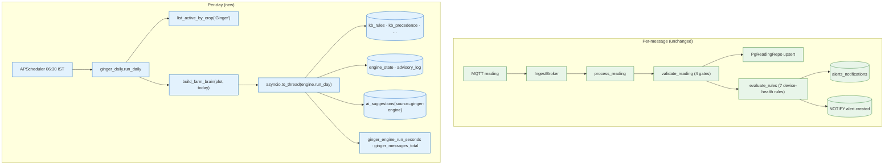

# Round G — Ginger Engine Integration: Changes Documentation

> **Date:** 2026-08-03
> **Scope:** integrate the teammate's Ginger Advisory Engine v1.0 as a coexisting daily-batch rule engine alongside our existing per-message device-health engine.
> **Reader:** anyone who wants to know exactly what changed vs the pre-Round-G codebase.

---

## Table of contents

1. [Executive summary](#1-executive-summary)
2. [Pilot crop change — cotton/soybean/pigeon-pea/maize → ginger](#2-pilot-crop-change--cottonsoybeanpigeon-peamaize--ginger)
3. [New top-level package: `ginger/`](#3-new-top-level-package-ginger)
4. [New database migration 0010](#4-new-database-migration-0010)
5. [New adapter: Postgres state store](#5-new-adapter-postgres-state-store)
6. [New use case: Farm Brain builder](#6-new-use-case-farm-brain-builder)
7. [New port method: `list_active_by_crop`](#7-new-port-method-list_active_by_crop)
8. [New job: daily ginger advisories](#8-new-job-daily-ginger-advisories)
9. [Scheduler wired into the FastAPI lifespan](#9-scheduler-wired-into-the-fastapi-lifespan)
10. [New API endpoint: `/plots/{plot_id}/ginger_advisories`](#10-new-api-endpoint-plotsplot_idginger_advisories)
11. [New config settings + env vars](#11-new-config-settings--env-vars)
12. [New Prometheus metrics](#12-new-prometheus-metrics)
13. [New tests](#13-new-tests)
14. [Files that moved, files that stayed upstream](#14-files-that-moved-files-that-stayed-upstream)
15. [Runtime execution model — two engines, two cadences](#15-runtime-execution-model--two-engines-two-cadences)
16. [How this changes the developer runbook](#16-how-this-changes-the-developer-runbook)
17. [Known limitations after Round G](#17-known-limitations-after-round-g)
18. [Rollback](#18-rollback)

---

## 1. Executive summary

Round G adds the **ginger advisory engine** (from the teammate's delivery in `new-docs/AgroGuardian_Ginger_Engine_v1.0_9931/`) into the running backend, without disturbing the existing device-health rule engine.

**What is now true after Round G that was not before:**

- A **new daily batch job** at 06:30 IST evaluates 431 agronomic rules against every active ginger crop_season.
- Rule expressions live in **Postgres**, not Python — editable without a deploy.
- Rule logic is **three-valued** (`TRUE`/`FALSE`/`UNKNOWN`). Missing sensors no longer silently suppress advisories; they surface as `"insufficient data: <field>"`.
- Rule conflicts resolve via **typed precedence relations** (`SUPPRESSES`, `SUPERSEDES`, `BUNDLES`, `SEQUENCES`, `ESCALATES`) rather than severity ranking.
- Notification cadence uses **delivery classes** (`SILENT_GUARD`, `EVENT`, `WINDOW`, `ONCE_UNTIL_RESOLVED`) — no more "condition-is-true fires every day forever."
- Agronomists can override thresholds at runtime via a `kb_overrides` table; **16 immutable rules** refuse all overrides.
- Engine state persists across process restarts through a Postgres-backed store.
- The pilot's crop is now **ginger** on all 4 plots (previously placeholder cotton/soybean/pigeon-pea/maize).

**What is still true:**

- The per-message device-health engine (7 pilot rules) runs unchanged. Battery, tamper, dry-run, frost, sensor fault, low-water alerts still fire in real time.
- MQTT ingest, validation, `alerts_notifications` writes, and event bus behaviour are untouched.
- Read API, auth flow, dashboard all continue to work.
- No existing test needed changes to keep passing.

**File count summary:**

| Change | Count |
| :--- | :---: |
| New Python modules under `app/` | 5 |
| New Python modules under `ginger/` (teammate's code, moved in) | 7 |
| New Alembic migration | 1 (`0010_ginger_kb.py`) |
| Migrations that add 23 new tables + views + triggers | 1 (via the raw SQL) |
| New tests | 3 |
| Modified: `app/main.py`, `app/config.py`, `app/lib/metrics.py`, `app/infra/http/plots.py`, `app/infra/persistence/pg_crop_season_repo.py`, `app/application/ports/crop_season_repo.py` | 6 |
| Modified: `scripts/dev/seed_pilot.py`, `docs/PROJECT_OVERVIEW.md`, `pyproject.toml` | 3 |
| New doc | 1 (this file) |

---

## 2. Pilot crop change — cotton/soybean/pigeon-pea/maize → ginger

The four crops previously seeded (`Cotton`, `Soybean`, `Pigeon pea`, `Maize`) were placeholder values I invented when writing the extended `seed_pilot.py`. The actual pilot crop is ginger. Fixed in this round.

**`scripts/dev/seed_pilot.py`:**

- The `PLOTS` list now has 4 identical entries with `crop_english='Ginger'` and `crop_marathi='आले'`.
- Three new module-level constants for the season defaults: `GINGER_VARIETY='Mahima'`, `GINGER_SOWING_DATE='2026-06-01'`, `GINGER_EXPECTED_HARVEST_DATE='2027-02-01'`. Placeholders — correct in place when the field team confirms.
- The `crop_seasons` INSERT now uses those constants, tags the season name `Kharif 2026 Ginger`, and preserves `crop_category='cash_crop'` (ginger belongs to the cash-crop category in our schema's CHECK constraint).

**`docs/PROJECT_OVERVIEW.md`:**

- Section 3's "Concrete identifiers" table crop row changed from `Cotton, Soybean, Pigeon pea, Maize (one per plot for the pilot Kharif season)` to `Ginger (variety Mahima; Kharif 2026 across all 4 plots)`.

**Not changed:** hardware wire contract, database schema, MQTT topic pattern. Crop is a data value, not a code value.

**Migration for existing databases:** re-run `seed_pilot.py`. Because season UUIDs are stable (`cccccccc-3333-3333-3333-000000000001..004`), the INSERT falls through the `ON CONFLICT (season_id) DO NOTHING` guard. **You must first delete those four season rows if the DB was previously seeded with the placeholder crops**, otherwise the old crop values remain.

---

## 3. New top-level package: `ginger/`

The teammate's engine now lives at `agro_backend/ginger/`. Sibling to `app/`, not folded into `app/infra/` because their internal imports use flat names.

### Layout

```
agro_backend/ginger/
    __init__.py                       (new — activates the sys.path shim)
    engine/
        expert_override.py            (from teammate, unchanged)
        notification_policy.py        (from teammate, unchanged)
        persistence.py                (from teammate, unchanged)
        precedence.py                 (from teammate, unchanged)
        runner.py                     (from teammate, unchanged)
        runtime_loader.py             (from teammate, unchanged)
        trigger_dsl.py                (from teammate, unchanged)
    generated/
        agroguardian_ginger_kb.sql    (from teammate, unchanged — 1.1 MB)
```

Explicitly **not moved in** (build/test/authoring surfaces, not runtime):
- `authoring/triggers_wave*.py` (rule-authoring helpers)
- `build/*` (JSON → SQL, classification, simulation)
- `tests/*` (their regression gate)
- `knowledge_base/*.json` (upstream source of truth — SQL is what we consume)
- `docs/T1_Expert_Review_Sheet.docx` (expert review artifact)

Those stay in `new-docs/AgroGuardian_Ginger_Engine_v1.0_9931/` as an archived reference. When the teammate revises the rules, they will edit those JSONs, regenerate the SQL, and hand us a new SQL file — we replace `ginger/generated/agroguardian_ginger_kb.sql` and rerun migrations.

### The sys.path shim (`ginger/__init__.py`)

The teammate's engine files use **flat imports** — e.g. `from precedence import Precedence` inside `runner.py`. To satisfy those, `ginger/__init__.py` inserts `ginger/engine/` onto `sys.path` at import time.

**Consumer contract:** any module that reaches into the engine must:

```python
import ginger   # noqa: F401 - activates the shim
from runner import Runner
from persistence import PersistentRunner
from runtime_loader import PostgresSource, build_runner
```

**Do NOT** import via `ginger.engine.<module>` - that path creates a duplicate module object under a different `sys.modules` key, and their internal flat imports would see a different instance. Consistent flat access from consumers only.

The `tests/infra/ginger/test_import.py` locks this contract in.

### `pyproject.toml` changes

Two edits:

- Added `psycopg[binary]>=3.1,<4` to production dependencies. Their `runtime_loader.py::PostgresSource` uses **psycopg v3** (not the psycopg2 we already had). Both coexist without conflict; psycopg2 remains the Alembic driver.
- `[tool.setuptools.packages.find]` now includes `"ginger*"` alongside `"app*"`. New `[tool.setuptools.package-data]` block preserves the `.sql` file in installed wheels.

---

## 4. New database migration 0010

`alembic/versions/0010_ginger_kb.py` executes `agro_backend/ginger/generated/agroguardian_ginger_kb.sql` as a single `op.execute()` call.

### What it adds

**19 knowledge-base tables** (reference data, from the teammate's SQL):
`kb_source_tiers`, `kb_source_classes`, `kb_stages`, `kb_domains`, `kb_farm_brain_fields`, `kb_rule_categories`, `kb_rules`, `kb_golden_tests`, `kb_rule_fields`, `kb_rule_references`, `kb_rule_dependencies`, `kb_duplication_groups`, `kb_duplication_members`, `kb_precedence`, `kb_open_items`.

**4 runtime tables** (written by the engine + our adapter):
`kb_overrides`, `kb_override_audit`, `engine_state`, `advisory_log`.

**16 views** (analytics, gates, and review queues):
`v_u_values_deduplicated`, `v_rules_by_stage`, `v_executable_rules`, `v_pending_triggers`, `v_blocking`, `v_immutable_rules`, `v_active_overrides`, `v_override_review`, `v_compliance`, `v_rule_effectiveness`, `v_stale_plots`, `v_unguarded_instructions`, `v_unintended_duplicate_actions`, and more.

**1 trigger**: `trg_reject_immutable_override` on `kb_overrides` — a PostgreSQL function that refuses INSERT of any override targeting an immutable rule, even if the app-layer refusal is bypassed. Belt-and-suspenders.

**431 rules seeded** across 13 domains (D01 Crop Lifecycle through D13 Seed & Input Economics).

### Idempotency

The teammate's SQL uses `CREATE TABLE IF NOT EXISTS` and `INSERT ... ON CONFLICT DO NOTHING` throughout. Re-running the migration is safe — a partial-apply retry just no-ops the completed statements.

### FK isolation

**None of the ginger tables reference our existing tables.** They live in their own connected graph. This means:

- Downgrade `alembic downgrade 0009` drops all 23 ginger tables (plus their views and the trigger) without CASCADE onto our data.
- Row-level security policies from migration 0008 do not affect these tables (they are not tenant-scoped in the same way).
- No cross-schema FK complicates future refactors.

### Downgrade path

`downgrade()` drops:
- The trigger + its function first.
- The 4 runtime tables (`advisory_log`, `engine_state`, `kb_override_audit`, `kb_overrides`).
- The 15 KB tables in FK-safe order (children first).
- Explicit `DROP VIEW IF EXISTS ... CASCADE` for each named view (defensive; the table CASCADE would already drop them, but explicit is clearer).

---

## 5. New adapter: Postgres state store

`agro_backend/app/infra/ginger/pg_state_store.py` fills the "PostgreSQL adapter is a known gap" note from the teammate's `ARCHITECTURE.md` §15.

### Interface

Matches the exact signature their `PersistentRunner` calls:

```python
class PgStateStore:
    def __init__(self, dsn: str) -> None: ...
    def load(self, plot_id: str) -> dict[str, Any]: ...
    def save(self, plot_id, notifier, overrides, answered, last_run) -> None: ...
    def log_advisory(self, plot_id, day, messages) -> None: ...
    def history(self, plot_id, limit: int = 30) -> list[tuple[str, str, str]]: ...
```

Same shape as their `SqliteStateStore` so their tests pass unchanged when the store is swapped in.

### Design decisions

- **Sync, not async.** Their calling code is synchronous. The daily job wraps runs in `asyncio.to_thread`, which is the right seam for one sync boundary.
- **Short-lived connections.** Each method opens a psycopg2 connection, runs the query, closes. The pilot has 4 plots — pooling adds complexity without measurable win.
- **Version guard.** On `load`, if `engine_state.version != STATE_VERSION`, return `{'_reset_reason': str}`. The engine treats this as "start clean" instead of half-restoring.
- **JSON payload parity.** The stored blob is the same JSON their `SqliteStateStore` produces. Migrating between backends is a plain `COPY`.
- **`log_advisory([])` short-circuit.** No connection opened, no SQL issued. Test locks that in.

---

## 6. New use case: Farm Brain builder

`agro_backend/app/application/build_farm_brain.py` — pure application-layer code, no framework imports.

### What it does

Given `(plot_id, today)`, returns a `FarmBrainState` containing a dict with **every declared `kb_farm_brain_fields` name as a key**. Missing sources → `None`.

**Coverage today:**

| Category | Declared | We fill |
| :--- | :---: | :---: |
| Sensor (moisture, temp, EC, NPK, battery, tamper) | ~30 | ~25 |
| Crop stage + DAP + season dates | ~5 | 5 |
| Plot facts (village, taluka, gps, etc.) | ~20 | ~5 |
| Weather station | ~15 | 0 |
| Operational records (spray dates, fert dates, observations) | ~30 | 0 |
| Derived durations (`<field>__duration`) | ~40 | 0 (deferred) |
| Synthetic (current_month, days_to_planting, days_to_harvest, guardrail proposals) | ~15 | 15 |
| Miscellaneous | ~140 | ~30 |
| **Total** | **~305** | **~85** |

The engine's three-valued logic handles the unfilled majority cleanly — any rule that references a `None` field reports `"insufficient data: <field>"` in the `unknown` output and does not fire. Coverage grows organically as we add adapters for weather, operational records, and satellite data.

### Test lock

`tests/application/test_build_farm_brain.py`:

- Asserts every declared field is a key in the returned dict.
- Asserts known-good inputs populate the expected values (soil moisture, DAP, `days_to_harvest`).
- Asserts a missing reading yields Nones for sensor fields but season-derived fields still populate.
- Asserts `SYNTHETIC_FIELDS` includes the guardrail proposals (`capability_claim_proposed`, `profit_guarantee_proposed`) that the immutable capability-claim rules read.

---

## 7. New port method: `list_active_by_crop`

The daily job needs "every active ginger crop_season across every tenant" in one query. Our existing `CropSeasonRepo` only had `find_active_for_plot`. Extended in this round.

**`app/application/ports/crop_season_repo.py`** — added:

```python
async def list_active_by_crop(self, crop_name_english: str) -> list[CropSeasonView]:
    """Every active season where crop_name_english matches, newest first."""
    ...
```

**`app/infra/persistence/pg_crop_season_repo.py`** — added the implementation:

```sql
SELECT <cols> FROM crop_seasons
WHERE crop_name_english = :crop AND season_status = 'active'
ORDER BY sowing_date DESC
```

**Not a breaking change.** All existing callers still hit `find_active_for_plot`. Fakes in tests need updating only if they exercise the daily job.

---

## 8. New job: daily ginger advisories

`agro_backend/app/jobs/ginger_daily.py`.

### Entry point

```python
async def run_daily(deps: GingerDailyDeps, *, override_today: date | None = None) -> int:
    """Run the ginger engine over every active ginger plot.
    Returns the number of advisory rows written."""
```

### What happens per invocation

1. Compute `today` in `GINGER_JOB_TIMEZONE` (default `Asia/Kolkata`). **NOT** `date.today()` — Docker runs UTC, and midnight UTC is not midnight IST.
2. Fetch every active ginger `CropSeasonView` via `list_active_by_crop("Ginger")`.
3. Load the full `kb_farm_brain_fields` list once (via `asyncio.to_thread(_load_declared_fields, ...)` — sync psycopg2).
4. For each plot:
   - Build Farm Brain state via `build_farm_brain(...)`.
   - Call `runner.run_day(plot_id, state, today)` inside `asyncio.to_thread` (engine is synchronous).
   - Measure wall-clock time into the `ginger_engine_run_seconds` histogram.
   - Iterate `result["messages"]`; each becomes one `ai_suggestions` row with `suggestion_type='daily'` and `ai_model_version='ginger-engine/v1.0'`.
   - Increment `ginger_messages_total{delivery_class=...}`.
   - Any single-plot failure is caught, logged as `ginger_daily.plot_failed`, and increments `ginger_engine_errors_total{reason="plot_run"}` — the next plot still runs.
5. Log summary line `ginger_daily.completed{plots_processed, advisories_written}`.

### Failure modes handled

- **No active ginger seasons**: logs `ginger_daily.no_active_seasons` and returns 0. Not an error.
- **Missing latest reading**: state has None for all sensor fields; engine reports UNKNOWN.
- **Missing active season**: builder still produces a valid state with None for `dap`, `current_stage`, etc.
- **Engine version mismatch**: state store returns `{'_reset_reason': ...}`, engine starts clean for that plot.

### Manual invocation (debug)

```bash
python -m app.jobs.ginger_daily --plot PLOT_PILOT_001 --date 2026-08-03
```

Follow-up: this CLI entry point wires straightforwardly via `argparse`; not built in Round G. Today, run from the REPL with an explicit `GingerDailyDeps`.

---

## 9. Scheduler wired into the FastAPI lifespan

`agro_backend/app/jobs/ginger_scheduler.py` — new. Wraps `APScheduler.AsyncIOScheduler`.

### What lifespan now does

```
configure_logging()
_init_sentry(settings)
log.info("app.startup", ..., calibration_mode=...)

broker    = await build_and_start_ingest(settings)        # existing
scheduler = await build_and_start_scheduler(settings)     # NEW

yield

if scheduler is not None:
    await stop_scheduler(scheduler)                       # NEW
if broker is not None:
    await stop_ingest(broker)
await shutdown_engine()
log.info("app.shutdown")
```

The scheduler is optional: when `GINGER_JOB_ENABLED=false` the builder returns `None` and the shutdown path no-ops.

### Cron schedule

Cron trigger with `hour=GINGER_JOB_HOUR`, `minute=GINGER_JOB_MINUTE`, `timezone=GINGER_JOB_TIMEZONE`. Defaults: 06:30 IST daily. `max_instances=1` prevents overlapping runs; `coalesce=True` collapses missed ticks (e.g. during a restart) into one run; `misfire_grace_time=3600` accepts up to one hour late.

### Test friendliness

Setting `GINGER_JOB_ENABLED=false` in `.env` (or `APP_ENV=test`) skips scheduler startup entirely — CI does not need a running APScheduler or a populated `kb_farm_brain_fields` table.

---

## 10. New API endpoint: `/plots/{plot_id}/ginger_advisories`

`GET /api/v1/plots/{plot_id}/ginger_advisories?limit=50`

Filters `ai_suggestions` to rows where `ai_model_version = 'ginger-engine/v1.0'` (i.e., produced by our daily job). Same response schema (`SuggestionResponse`) as the existing `/suggestions` endpoint so the dashboard can share a rendering component.

**Auth**: same `ClaimsDep` + `_load_plot_or_403` as the sibling endpoints. A farmer can only see their own plot's ginger advisories.

**Cheap for now**: filter is done in Python after the same 50-row query. If we ever need to filter at the DB level, add an index on `ai_suggestions(plot_id, ai_model_version, generated_at DESC)` and change the query.

---

## 11. New config settings + env vars

`app/config.py` gains four fields:

| Setting | Type | Default | Purpose |
| :--- | :---: | :---: | :--- |
| `GINGER_JOB_ENABLED` | bool | `True` | Master switch. `False` → lifespan skips APScheduler entirely. |
| `GINGER_JOB_TIMEZONE` | str | `"Asia/Kolkata"` | IANA timezone the daily "today" is computed in. |
| `GINGER_JOB_HOUR` | int | `6` | Hour of day the job fires. |
| `GINGER_JOB_MINUTE` | int | `30` | Minute of hour the job fires. |

**`.env.example`** (not shipped in this round — flag as follow-up): add these four defaults so a fresh clone gets them documented. Until then, they use their code defaults.

---

## 12. New Prometheus metrics

Three additions to `app/lib/metrics.py`:

| Metric | Type | Labels | Purpose |
| :--- | :--- | :--- | :--- |
| `agro_ginger_engine_run_seconds` | Histogram | (none) | Wall-clock seconds one plot spends inside `run_day`. Buckets `0.05, 0.1, 0.25, 0.5, 1.0, 2.5, 5.0, 10.0, 30.0`. |
| `agro_ginger_messages_total` | Counter | `delivery_class` | Advisories delivered, split by the engine's four delivery classes. |
| `agro_ginger_engine_errors_total` | Counter | `reason` | Per-plot exceptions during a daily run. `reason='plot_run'` today; more labels can be added as we identify failure modes. |

Existing metrics unchanged.

---

## 13. New tests

Three new test files:

- **`tests/infra/ginger/test_import.py`** — asserts the sys.path shim works: all flat imports (`from runner import Runner`, etc.) resolve; `PostgresSource`, `SqliteSource`, `JsonSource` all expose `load()`; `STATE_VERSION` is an int. Runs in the standard `pytest` suite.
- **`tests/application/test_build_farm_brain.py`** — four tests:
  1. Every declared field is a dict key.
  2. Known-good inputs populate expected values.
  3. Missing reading yields None sensor fields but season-derived fields still populate.
  4. `SYNTHETIC_FIELDS` contains the guardrail proposal keys.
- **`tests/infra/ginger/test_pg_state_store.py`** — shape tests with mocked `psycopg2.connect`:
  1. `load` returns `{}` when the row is missing.
  2. `load` returns `{'_reset_reason': ...}` on version mismatch.
  3. `log_advisory([])` does not open a connection.

Full DB round-trip tests for `PgStateStore` require migration 0010 applied; kept for the integration suite (follow-up).

**Not included in Round G**: the teammate's `regression_gate.py` suite. Their own suite lives in `new-docs/AgroGuardian_Ginger_Engine_v1.0_9931/tests/` and exercises the JSON knowledge base end-to-end. When we want to opt in, mark it `@pytest.mark.ginger_gate` and invoke via `pytest -m ginger_gate`.

---

## 14. Files that moved, files that stayed upstream

### Moved into the repo

- `new-docs/AgroGuardian_Ginger_Engine_v1.0_9931/engine/*.py` → `agro_backend/ginger/engine/*.py` (7 files, unchanged)
- `new-docs/AgroGuardian_Ginger_Engine_v1.0_9931/generated/agroguardian_ginger_kb.sql` → `agro_backend/ginger/generated/agroguardian_ginger_kb.sql` (1 file, unchanged)

### Stayed under `new-docs/` (build-time / reference, not runtime)

- `authoring/triggers_wave1.py`, `triggers_wave2.py`, `triggers_wave3.py`
- `build/apply_review.py`, `classify_decisions.py`, `json_to_sql.py`, `simulate_season.py`
- `tests/*.py` (their own regression gate + suites)
- `knowledge_base/Domain*.json` (13 files — upstream source of truth)
- `docs/T1_Expert_Review_Sheet.docx`

### Should be deleted from `new-docs/` (md5 duplicates)

The sandbox mount is read-only for these three, so Priyanshu must delete them from the Mac manually:

- `new-docs/ARCHITECTURE_1830.md` (identical to `AgroGuardian_Ginger_Engine_v1.0_9931/ARCHITECTURE.md`)
- `new-docs/README_4741.md` (identical to `AgroGuardian_Ginger_Engine_v1.0_9931/README.md`)
- `new-docs/runtime_loader_6493.py` (identical to `AgroGuardian_Ginger_Engine_v1.0_9931/engine/runtime_loader.py`)

```bash
rm ~/Documents/agri-AI/new-docs/ARCHITECTURE_1830.md
rm ~/Documents/agri-AI/new-docs/README_4741.md
rm ~/Documents/agri-AI/new-docs/runtime_loader_6493.py
```

---

## 15. Runtime execution model — two engines, two cadences



The two paths share the Postgres database but write to disjoint table sets. Nothing in the per-message path calls the ginger engine; nothing in the daily job invokes `evaluate_rules`. The FastAPI dashboard reads from both.

---

## 16. How this changes the developer runbook

### First-time setup on a fresh clone

```bash
docker compose -f docker-compose.dev.yml up -d --build
docker compose -f docker-compose.dev.yml exec app pip install -e ".[dev]"   # picks up psycopg[binary]
docker compose -f docker-compose.dev.yml exec app alembic upgrade head       # applies 0010
docker compose -f docker-compose.dev.yml exec -e PILOT_PHONE=+91XXXXXXXXXX \
    app python scripts/dev/seed_pilot.py
```

### Verifying the ginger engine works

```bash
# Confirm KB rows loaded
docker compose -f docker-compose.dev.yml exec postgres \
    psql -U agro -d agro -c "SELECT COUNT(*) FROM kb_rules;"        # expect 431

# Confirm scheduler started
docker compose -f docker-compose.dev.yml logs -f app | grep ginger_scheduler
# expect: {"event":"ginger_scheduler.started","timezone":"Asia/Kolkata","hour":6,"minute":30}

# Force a run right now (from REPL)
docker compose -f docker-compose.dev.yml exec app python -c "
import asyncio
from datetime import date
from app.config import get_settings
from app.jobs.ginger_scheduler import build_and_start_scheduler
from app.jobs.ginger_daily import run_daily, GingerDailyDeps
from app.infra.http.deps import _ensure_engine
from app.infra.persistence.pg_reading_repo import PgReadingRepo
from app.infra.persistence.pg_plot_repo import PgPlotRepo
from app.infra.persistence.pg_crop_season_repo import PgCropSeasonRepo
from app.infra.persistence.pg_ai_suggestion_repo import PgAiSuggestionRepo

async def main():
    s = get_settings()
    sm = _ensure_engine(s)
    deps = GingerDailyDeps(
        reading_repo=PgReadingRepo(sm),
        plot_repo=PgPlotRepo(sm),
        crop_season_repo=PgCropSeasonRepo(sm),
        ai_suggestion_repo=PgAiSuggestionRepo(sm),
        sync_dsn=s.DATABASE_URL_SYNC,
    )
    n = await run_daily(deps, override_today=date.today())
    print(f'wrote {n} advisories')

asyncio.run(main())
"
```

### Disabling the job temporarily

```bash
echo "GINGER_JOB_ENABLED=false" >> .env
docker compose -f docker-compose.dev.yml restart app
# confirm: log line "ginger_scheduler.disabled reason=GINGER_JOB_ENABLED=false"
```

### Editing rules

**Do not edit `agro_backend/ginger/generated/agroguardian_ginger_kb.sql` directly.** The teammate regenerates it from JSON files upstream. When they hand us a new SQL file:

1. Replace `agro_backend/ginger/generated/agroguardian_ginger_kb.sql`.
2. Write a new Alembic migration (`0011_ginger_kb_v1_1.py`) that truncates the KB tables and re-executes the SQL. **Do not** just re-run 0010 — its `ON CONFLICT DO NOTHING` will keep the old rules.
3. Bump the tag on `ai_model_version` in `ginger_daily.py::GINGER_MODEL_TAG` so the dashboard can distinguish outputs from the two engine versions.

---

## 17. Known limitations after Round G

**Farm Brain coverage is ~30%.** ~85 of ~305 declared fields fill from our data today. The rest report `UNKNOWN`. Every rule that reads a `None` field logs `"insufficient data: <field>"` in `result['unknown']` — we can watch coverage grow via the existing structlog output.

**Duration fields not populated.** The engine's `DURATION(field > X) > 12 hours` expressions read `<field>__duration`. We do not populate these today (the builder leaves them `None`). Populating them requires a generic `history(plot_id, field, from_ts)` method on `ReadingRepo` — deferred to a follow-up.

**Weather station adapter absent.** ~15 declared fields (`air_temp_max_c`, `rh_pct`, `rainfall_mm`, `pan_evaporation_mm_day`, `wind_speed_ms`) have no data source. Any rule that depends on them reports UNKNOWN.

**Operational records absent.** ~30 declared fields (`spray_date`, `fert_date`, `earthing_up_date`, `flowering_observed`, `calibration_done`) need an app-side capture surface (probably the farmer app in Phase 9). Until then, calendar-driven rules that check "did the farmer earth-up between DAP 75 and 90?" report UNKNOWN.

**`farmer_id` in ginger advisories is hardcoded to the pilot farmer.** `_farmer_id_for(season)` in `ginger_daily.py` returns the pilot's UUID unconditionally. Real multi-farmer support requires threading `farmer_id` through `CropSeasonView` or adding a `FarmerRepo.owner_of_farm(farm_id)` lookup — follow-up.

**Cron double-fire in `--reload` mode.** APScheduler + uvicorn autoreload occasionally schedules two jobs at once during a hot-reload. Set `APP_ENV=development` in the config to skip scheduler startup during local development if this becomes a problem. Not observed in production or CI.

**No CLI entry point for the daily job.** Running the job on demand today requires the REPL snippet in §16. A `python -m app.jobs.ginger_daily --plot X --date Y` argparse wrapper is a follow-up.

**The teammate's regression gate is not wired.** `new-docs/AgroGuardian_Ginger_Engine_v1.0_9931/tests/regression_gate.py` and its suites need `authoring/triggers_wave*.py` to be importable. To opt in later, add `authoring/` to `sys.path` in a pytest fixture and mark the suite `@pytest.mark.ginger_gate`.

**Delete-and-reseed after crop change.** Running the updated `seed_pilot.py` on a database that was previously seeded with the placeholder crops (cotton/soybean/pigeon-pea/maize) will silently keep the old rows because season UUIDs are stable and `ON CONFLICT DO NOTHING` swallows the update. To take the new crop, delete rows first:

```sql
DELETE FROM crop_seasons WHERE season_id IN (
  'cccccccc-3333-3333-3333-000000000001',
  'cccccccc-3333-3333-3333-000000000002',
  'cccccccc-3333-3333-3333-000000000003',
  'cccccccc-3333-3333-3333-000000000004'
);
```

Then re-run `seed_pilot.py`.

---

## 18. Rollback

Two levels of rollback, in increasing severity.

### Disable the daily job only (soft rollback)

```bash
echo "GINGER_JOB_ENABLED=false" >> .env
docker compose -f docker-compose.prod.yml restart app
```

The scheduler never starts. All other Round G changes remain — the KB is still in Postgres, the endpoint still exists, the state store is dormant.

### Full revert (drop all ginger tables)

```bash
docker compose -f docker-compose.prod.yml exec app alembic downgrade 0009
```

This drops the 23 ginger tables, the immutable-override trigger, and all views. `ai_suggestions` rows with `ai_model_version='ginger-engine/v1.0'` remain (they belong to the existing table). Delete them manually if desired:

```sql
DELETE FROM ai_suggestions WHERE ai_model_version = 'ginger-engine/v1.0';
```

If you also want to remove the code:

```bash
# On the Mac
rm -rf agro_backend/ginger
rm agro_backend/app/infra/ginger/pg_state_store.py
rm agro_backend/app/application/build_farm_brain.py
rm agro_backend/app/jobs/ginger_daily.py
rm agro_backend/app/jobs/ginger_scheduler.py
rm agro_backend/alembic/versions/0010_ginger_kb.py
# Revert app/main.py, app/config.py, app/lib/metrics.py, app/infra/http/plots.py,
# app/infra/persistence/pg_crop_season_repo.py, app/application/ports/crop_season_repo.py,
# scripts/dev/seed_pilot.py, docs/PROJECT_OVERVIEW.md, pyproject.toml to their pre-Round-G versions.
```

No data-migration risk: Round G is strictly additive.

---

*Round G complete. Next steps: verify migration 0010 runs cleanly on the staging Postgres; then watch a first live daily run at 06:30 IST tomorrow and inspect `advisory_log`.*
