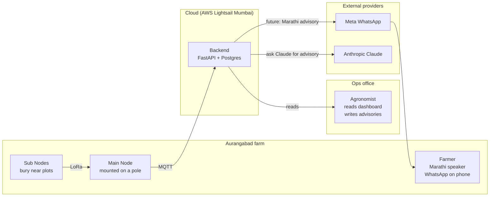
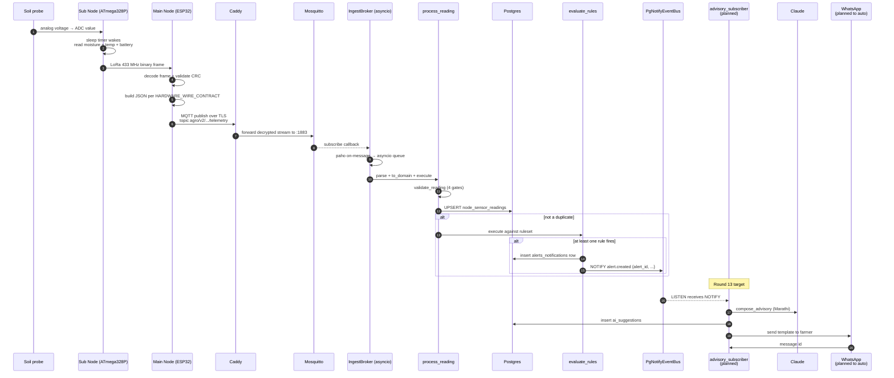
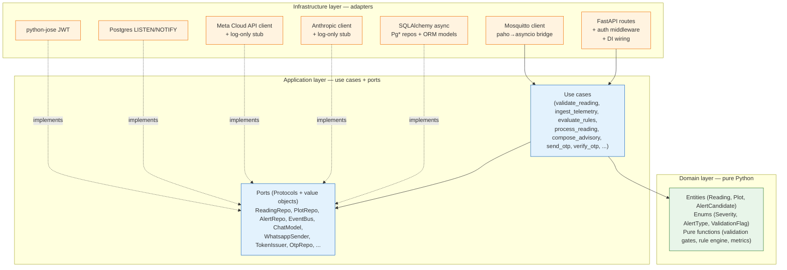
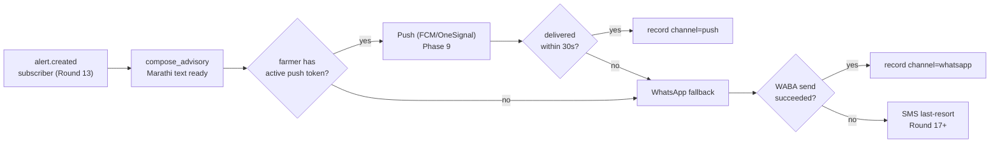
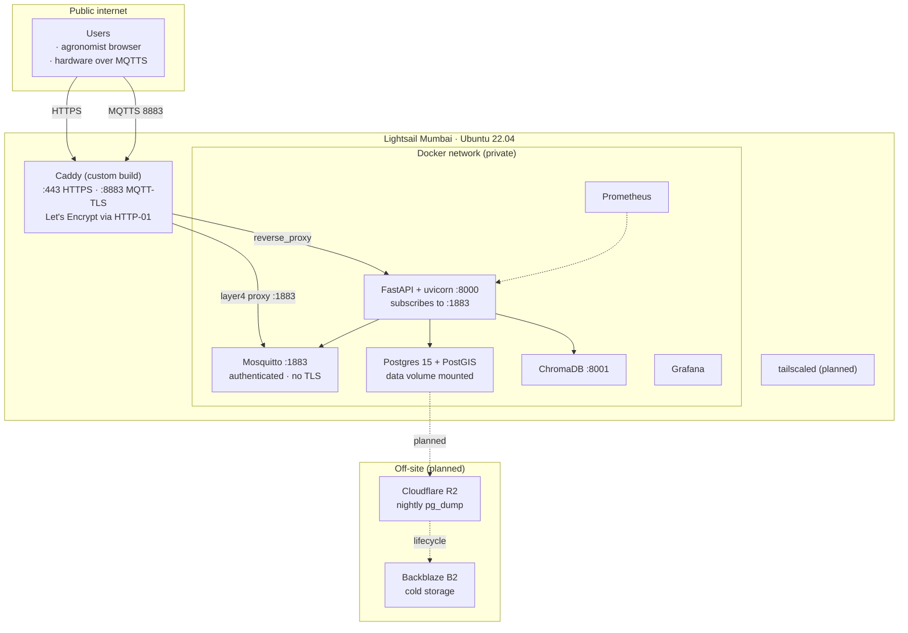

# AgroGuardian V2 — Project Overview


> **Who this is for.** You, a week from now. Anyone new to the project. Anyone who has shipped part of it and wants to understand the whole.
>
> **What it explains.** Everything, in the order you should build mental models: *why* → *who* → *what* → *how*. Every section has enough context to stand alone, and points to the specific docs for deeper dives.
>
> **How to read it.** Front-to-back once. Then use the table of contents to jump back when a specific piece confuses you.


---


## Table of contents


1. [What AgroGuardian is](#1-what-agroguardian-is)
2. [The problem we are solving](#2-the-problem-we-are-solving)
3. [The pilot in concrete terms](#3-the-pilot-in-concrete-terms)
4. [Who touches the system — the actors](#4-who-touches-the-system--the-actors)
5. [The physical hardware — VIRAAI v1.0](#5-the-physical-hardware--viraai-v10)
6. [The digital system — one-picture architecture](#6-the-digital-system--one-picture-architecture)
7. [Life of one reading — end-to-end trace](#7-life-of-one-reading--end-to-end-trace)
8. [The backend — hexagonal architecture explained](#8-the-backend--hexagonal-architecture-explained)
9. [Every folder, what it does](#9-every-folder-what-it-does)
10. [The database — 35 tables grouped by purpose](#10-the-database--35-tables-grouped-by-purpose)
11. [The rule engine and the 7 pilot rules](#11-the-rule-engine-and-the-7-pilot-rules)
12. [Notification strategy — push → WhatsApp → SMS](#12-notification-strategy--push--whatsapp--sms)
13. [Authentication — OTP + JWT](#13-authentication--otp--jwt)
14. [Environments — dev, staging, prod](#14-environments--dev-staging-prod)
15. [Deployment topology](#15-deployment-topology)
16. [Configuration — every environment variable](#16-configuration--every-environment-variable)
17. [Testing — why the tests are shaped this way](#17-testing--why-the-tests-are-shaped-this-way)
18. [What's really running vs what's scaffolded](#18-whats-really-running-vs-whats-scaffolded)
19. [Roadmap — what comes next](#19-roadmap--what-comes-next)
20. [Glossary of terms](#20-glossary-of-terms)
21. [Cheat sheet of common commands](#21-cheat-sheet-of-common-commands)
22. [Where to look when confused](#22-where-to-look-when-confused)


---


## 1. What AgroGuardian is


AgroGuardian is a **precision-agriculture platform** — sensors in the field, data in the cloud, timely advice on the farmer's phone.


In one sentence: **buried sensors send soil and battery data to the cloud, two rule engines watch the data (a small per-message device-health engine and a large daily ginger-advisory engine), and the farmer receives short Marathi advisories on WhatsApp today and in an in-house app tomorrow.**


The pilot is a single farm in **Aurangabad, Maharashtra**. The pilot proves the loop end-to-end: physical sensor → LoRa radio → 4G modem → MQTT → backend → alert → farmer's phone. Once the loop works for one farm we can duplicate it for many.


---


## 2. The problem we are solving


Smallholder farmers in Aurangabad make daily irrigation and crop-management decisions with incomplete information. Common failure modes:


- **Over-irrigation.** Water is scarce and grid-electric pumping is expensive. Farmers often over-water because they cannot see moisture below the surface.
- **Under-irrigation.** In the opposite direction, farmers miss dry patches that show up on satellite weeks later once yield is already lost.
- **Pump dry-run.** Groundwater tables drop mid-season. Pumps run against no water, burn out motors, and require expensive replacement.
- **Frost damage.** Sudden cold snaps in the root zone kill young plants overnight. Farmers wake up to already-damaged crops.
- **No feedback loop.** When an agronomist gives generic advice, there is no way to check if the farmer applied it or whether it worked.


AgroGuardian addresses all five with a small, cheap sensor node buried in each plot, a rule engine that watches those readings continuously, and a farmer-facing channel that speaks Marathi and is short enough to read on a feature phone.


Not solving today: pest detection, market pricing, subsidy paperwork, satellite imagery. Those come later.


---


## 3. The pilot in concrete terms


Numbers small enough to hold in one hand:


- **1 farm** in Aurangabad
- **1 farmer** with a WhatsApp number and an Android phone (soon: the in-house AgroGuardian app)
- **2 plots** on that farm (revised 2026-08-26; scope reduced from 4 → 2 to focus the initial field validation on one instrumented plot + one satellite-only plot; more can be added later)
- **1 Sub Node** — the field sensor device, physically buried near the instrumented plot
- **1 Main Node** — the gateway that collects LoRa frames from the Sub Node and pushes them to the cloud over 4G
- **1 Postgres database** in the cloud that stores every reading, every alert, every farmer, every device
- **1 FastAPI backend** in the cloud that ingests MQTT, runs rules, and exposes read APIs
- **1 Streamlit dashboard** for the ops team to inspect what is happening


The single pilot Sub Node covers **one plot** (`PLOT_PILOT_001`) via its moisture probe. `PLOT_PILOT_002` is satellite-only for now (no sub node attached). Additional plots can be added by extending `scripts/dev/seed_pilot.py::PLOTS` — MQTT payloads carry the originating Sub Node ID, so identification scales without further code changes.


**Concrete identifiers seeded by `scripts/dev/seed_pilot.py`:**


| Thing | Value |
| :--- | :--- |
| Tenant | `11111111-1111-1111-1111-111111111111` |
| Farmer | `aaaaaaaa-1111-1111-1111-111111111111` |
| Farm | `bbbbbbbb-2222-2222-2222-222222222222` |
| Main Node | `AGR-MN-0001` (device_type = `master_node`) |
| Sub Node 1 | `AGR-SN-0001` → **`PLOT_PILOT_001`** (only Sub Node in the current pilot) |
| Plots | `PLOT_PILOT_001` (hardware, instrumented by Sub Node 1) and `PLOT_PILOT_002` (satellite-only, `plots.node_id = NULL`). Scope revised 2026-08-26 from 4 → 2 plots; add more by extending `scripts/dev/seed_pilot.py::PLOTS`. |
| Crops | Ginger (variety Mahima; Kharif 2026, both plots) |
| Ginger sowing / harvest | `2026-06-01` / `2027-02-01` (placeholders — dial in with the field team) |


Once you know these identifiers, everything else in the code and database will make sense.


---


## 4. Who touches the system — the actors





Five human/machine actors show up throughout the codebase:


1. **The farmer** — Marathi-only strings, WhatsApp OTP + advisories, eventually push notifications through the app.
2. **The agronomist / ops team** — Streamlit dashboard, English UI, sees every plot in the tenant, can filter alerts by severity, resolve them.
3. **The Sub Node** — dumb sensor package with a LoRa radio. Cannot speak to the internet. Wakes up, reads soil, sends binary LoRa frame to the Main Node, sleeps.
4. **The Main Node** — smart gateway. Receives LoRa frames, decodes them, constructs JSON, publishes to MQTT over 4G. Also handles time sync, TLS, and retries.
5. **The backend** — the star of this repo. Everything downstream of MQTT lives here.


---


## 5. The physical hardware — VIRAAI v1.0


The hardware is separate from this repo but the backend has to accept whatever it emits. Full spec: `AgroGuardian_FINAL_Roadmap.md` (upstream) and the [hardware wire contract](HARDWARE_WIRE_CONTRACT.md) in this repo.


### Sub Node


- **MCU:** ATmega328P-PU at 3.3 V with an 8 MHz external crystal.
- **Why 328P instead of ESP32:** ultra-low power. Deep sleep between reads, 20 W solar panel + rechargeable battery, months of unattended operation.
- **No WiFi, no BLE.** The only wireless radio is LoRa. This matters for firmware updates — see §12 of [CODEBASE_GUIDE](CODEBASE_GUIDE.md) and the OTA discussion below.
- **LoRa module:** AiThinker RA-02 (Semtech SX1278 chip) at 433 MHz.
- **Sensors today:** DS18B20 (OneWire temperature), capacitive soil moisture. Coming: RS485 NPK Modbus RTU, battery voltage divider.
- **Constraints:** 32 KB flash / 2 KB SRAM / 1 KB EEPROM. Every byte matters. This is why LoRa frames are binary, never JSON.


### Main Node


- **MCU:** ESP32-WROOM-32 Dev Module (38-pin), dual-core 240 MHz, WiFi + BLE (though we use 4G for the WAN path, not WiFi).
- **LoRa:** same RA-02/SX1278 as the Sub Node.
- **LoRa SPI pin map (fixed in hardware):** SCK=18, MISO=19, MOSI=23, NSS=5, RESET=14, DIO0=26.
- **4G modem:** SIMCom A7672S LTE Cat-1 on hardware UART2.
- **Also on the board:** MicroSD (buffer for offline periods), INA219 (current sensor), DS3231 (real-time clock).
- **Development environment:** Arduino IDE today (PlatformIO migration planned).
- **Framework:** Arduino.
- **Libraries expected:** SPI, LoRa (Sandeep Mistry), DallasTemperature, OneWire, Wire, TinyGSM, PubSubClient, SD, RTclib.


### LoRa packet policy


**Binary only, never JSON over LoRa.** SX1278 payload size caps out around 255 bytes and airtime is expensive. The packet contains: `node_id`, packet counter, battery voltage, battery percent, temperature, soil moisture, N, P, K, flags, CRC. Exact byte widths are still being finalized — see the outstanding "LoRa Packet Protocol v1.0" doc.


**JSON only happens on the Main Node → Cloud hop**, over MQTT, over 4G. The Main Node's job is to translate the LoRa binary format into the JSON schema documented in [HARDWARE_WIRE_CONTRACT](HARDWARE_WIRE_CONTRACT.md).


### SIM card


BSNL for the pilot, APN `bsnlnet`. Firmware must accept APN change at runtime (Airtel, Jio, BSNL) so we do not have to recompile every time we swap SIMs.


### Power


- Sub Node: 20 W solar → LiFePO4 battery → 3.3 V regulator → MCU. Deep sleep between reads keeps average current in the micro-amp range.
- Main Node: solar panel → battery → ESP32 → 4G modem. Runs continuously (the modem cannot deep-sleep the same way).


---


## 6. The digital system — one-picture architecture


```mermaid
flowchart TB
    subgraph FIELD["Physical world"]
        SUB["Sub Node<br/>ATmega328P<br/>+ soil probes"]
        MAIN["Main Node<br/>ESP32-WROOM<br/>+ A7672S 4G"]
        SUB -- "LoRa 433 MHz<br/>binary frame" --> MAIN
    end


    subgraph CLOUD["Lightsail Mumbai VPS"]
        CADDY["Caddy<br/>TLS on :443 + :8883"]
        MOSQ["Mosquitto<br/>internal :1883"]
        API["FastAPI backend<br/>uvicorn :8000"]
        DB[("Postgres 15<br/>+ PostGIS"):::db]
        CH[("ChromaDB<br/>:8001"):::db]
        PROM["Prometheus<br/>+ Grafana"]
    end


    subgraph EXTERNAL["Third-party"]
        WA["Meta WhatsApp<br/>Cloud API"]
        CL["Anthropic Claude"]
    end


    subgraph HUMANS["People"]
        AGR["Agronomist<br/>Streamlit dashboard"]
        FARMER["Farmer<br/>WhatsApp on phone"]
    end


    MAIN -- "MQTT over TLS 8883" --> CADDY
    CADDY -- "raw MQTT :1883" --> MOSQ
    MOSQ -- "subscribe topic" --> API
    API <--> DB
    API <--> CH
    API -- "planned" --> CL
    API -- "planned" --> WA
    WA --> FARMER
    AGR -- HTTPS --> CADDY
    CADDY -- reverse proxy --> API
    PROM -- scrape --> API


    classDef db fill:#ffe082,stroke:#f57c00
```


Verbal walkthrough of that picture:


- **Field side.** A Sub Node wakes up, samples its probes, wraps the values in a small binary frame, and shoots it over LoRa to the Main Node. The Main Node decodes the frame, formats a JSON payload, and publishes over MQTT-TLS to `mqtts-<ip>.sslip.io:8883`.
- **Edge terminator.** Caddy sits at the network edge. It handles TLS for both HTTPS (the API and dashboard) and MQTTS (the field hardware). Behind Caddy, everything is plain TCP on the private Docker network.
- **Mosquitto** accepts the message on port 1883 (internal only — never exposed publicly directly), and the FastAPI backend is subscribed to `agro/v2/+/+/+/telemetry`.
- **The backend** validates the message, deduplicates against existing readings, persists to Postgres, evaluates the rule engine, and (if a rule fires) writes a row to `alerts_notifications` and emits a `NOTIFY` on the Postgres event bus.
- **External providers.** Anthropic Claude generates Marathi advisories on demand. Meta WhatsApp delivers OTPs today; when the automatic-dispatch subscriber ships, WhatsApp will also deliver advisories.
- **People.** The agronomist accesses everything through the Streamlit dashboard (which itself calls the FastAPI read endpoints — no direct database access). The farmer receives OTPs and eventually advisories on WhatsApp.


---


## 7. Life of one reading — end-to-end trace


A single soil-moisture reading, from voltage on a probe to a Marathi sentence in the farmer's chat. Some steps are live today; some are scaffolded but not yet wired. Both are marked below.





**Which steps are live today (after your recent code):**


- Steps 1–11: **live.** A Sub Node reading over LoRa gets into the database if the Main Node firmware publishes MQTT correctly.
- Steps 12–13: **live.** `CALIBRATION_MODE=true` short-circuits the rules; set to `false` and rules engage.
- Steps 14–20: **scaffolded but not wired.** `compose_advisory` exists as a use case (`app/application/compose_advisory.py`). No process runs it automatically. Today, an operator would call it from the REPL.


Round 13 is the round that closes that gap.


---


## 8. The backend — hexagonal architecture explained


The backend follows **ports and adapters**, a.k.a. **hexagonal architecture**. Three concentric layers with strict rules about which can import which.





### Layer rules — enforced by tests


The rules are not just convention; two AST-scanning tests fail the build if they are violated.


| Layer | Path | Allowed imports | Forbidden imports |
| :--- | :--- | :--- | :--- |
| Domain | `app/domain/` | stdlib, `typing`, `decimal`, `uuid`, `datetime`, `enum`, `dataclasses` | Everything else, especially `fastapi`, `sqlalchemy`, `pydantic`, `structlog` |
| Application | `app/application/` | `app.domain.*`, `app.application.*`, stdlib | All third-party frameworks; even `structlog` is forbidden — logging is an infra concern |
| Infrastructure | `app/infra/` | Anything | Nothing forbidden |


The tests: `tests/domain/test_domain_purity.py` and `tests/application/test_application_purity.py`. They walk the AST of every file under the target directory and fail if a forbidden import name appears.


### Why bother?


Because the day we outgrow Postgres LISTEN/NOTIFY and want Redis Streams, the swap happens in one file (`app/infra/events/pg_notify_bus.py` becomes `app/infra/events/redis_stream_bus.py`). Domain and use cases do not change. Same story for swapping ChromaDB for pgvector, Streamlit for React, or Meta WhatsApp for a Twilio route.


More concretely: the pilot rule engine is 264 lines of pure Python with zero framework dependencies. You could copy that file into a Jupyter notebook and run it on a CSV of readings. That is the layer we protect from framework churn.


---


## 9. Every folder, what it does


Annotated tree of everything under `agro_backend/`:


```
agro_backend/
├─ alembic/                        Database migration engine
│  └─ versions/                    11 hand-written migrations (0001–0011)
│                                  0010 loads the ginger knowledge base
│                                  0011 adds water_pressure_bar
│
├─ app/                            The backend application
│  ├─ config.py                    Typed environment settings; includes
│  │                               CALIBRATION_MODE + GINGER_JOB_* flags
│  ├─ deps.py                      Legacy shim; most DI is in infra/http/deps.py
│  ├─ main.py                      FastAPI factory + lifespan (spawns IngestBroker
│  │                               AND the ginger APScheduler)
│  │
│  ├─ domain/                      PURE — no framework imports
│  │  ├─ alert.py                  AlertCandidate, Severity, AlertType, DispatchStatus
│  │  ├─ auth.py                   Access/refresh claims, hash helpers, RefreshSecret
│  │  ├─ metrics.py                DerivedMetrics + battery/moisture/frost thresholds
│  │  ├─ plot.py                   Plot value object
│  │  ├─ rule_definitions.py       The 7 pilot device-health rules (Marathi)
│  │  ├─ rules.py                  Rule, RuleSet, evaluate() — pilot engine itself
│  │  ├─ sensor.py                 Reading value object (adds water_pressure_bar)
│  │  └─ validation_gates.py       4 pure gates (range, stuck, MAD, cross-sensor)
│  │
│  ├─ application/                 Use cases — no framework imports
│  │  ├─ build_farm_brain.py       Assembles per-plot per-day dict for the ginger engine
│  │  ├─ compose_advisory.py       Alert → Claude → Marathi advisory → persist
│  │  ├─ evaluate_rules.py         Reading + metrics → alerts + events
│  │  ├─ ingest_telemetry.py       Validate + save + publish
│  │  ├─ logout.py                 Revoke one refresh session
│  │  ├─ process_reading.py        MQTT-side composer: validate → persist → rules
│  │  ├─ refresh_token.py          Rotate refresh; mint new access
│  │  ├─ send_otp.py               Rate-limit + hash + WhatsApp deliver
│  │  ├─ validate_reading.py       Orchestrates the 4 validation gates
│  │  ├─ verify_otp.py             Constant-time compare + mint tokens
│  │  └─ ports/                    Protocol definitions
│  │
│  ├─ infra/                       Adapters — the only layer that imports frameworks
│  │  ├─ ai/                       Reserved for future RAG helpers (empty)
│  │  ├─ auth/                     python-jose HS256 issuer + verifier
│  │  ├─ events/                   PgNotifyEventBus (publish over Postgres NOTIFY)
│  │  ├─ forecast/                 Reserved for weather adapter (empty)
│  │  ├─ ginger/                   Postgres-backed state store for the ginger engine
│  │  ├─ http/                     FastAPI routes + DI (adds /ginger_advisories)
│  │  ├─ llm/                      Anthropic client + log-only stub
│  │  ├─ mqtt/                     paho client + drain loop + pydantic wire schemas
│  │  │                            (TelemetryIn now accepts water_flow + water_pressure)
│  │  ├─ notify/                   Reserved for FCM/SMS push adapters (empty)
│  │  ├─ ota/                      Reserved for firmware OTA server (empty)
│  │  ├─ persistence/              Async engine + all Pg* repos + SQLAlchemy models
│  │  ├─ satellite/                Reserved for Sentinel-2 fetcher (empty)
│  │  ├─ storage/                  Reserved for R2/B2 object storage adapters (empty)
│  │  └─ whatsapp/                 Meta Cloud API sender + log-only stub
│  │
│  ├─ jobs/                        Long-lived background tasks
│  │  ├─ ingest_startup.py         Starts IngestBroker in the lifespan
│  │  ├─ ginger_daily.py           run_daily(): iterates active ginger crop_seasons
│  │  └─ ginger_scheduler.py       APScheduler wrapper, 06:30 IST cron
│  └─ lib/                         Cross-cutting helpers
│     ├─ logging.py                structlog configuration
│     ├─ metrics.py                Prometheus registry (adds ginger_engine_* metrics)
│     └─ time.py                   tz-aware datetime helpers
│
├─ ginger/                         Teammate's ginger advisory engine (v1.0)
│  ├─ __init__.py                  sys.path shim for the flat-import engine files
│  ├─ engine/                      7 files: trigger_dsl, precedence, notification_policy,
│  │                               expert_override, persistence, runner, runtime_loader
│  └─ generated/
│     └─ agroguardian_ginger_kb.sql  1.1 MB compiled knowledge base — DO NOT EDIT
│
├─ dashboard/                      Streamlit operations dashboard
├─ deploy/                         Caddy (custom Layer-4 build) + Mosquitto + Prom + staging + Coolify
├─ docs/                           This directory
│  ├─ API_REFERENCE.md
│  ├─ CODEBASE_GUIDE.md
│  ├─ CONFIGURATION.md
│  ├─ DEVELOPMENT.md
│  ├─ FILE_REFERENCE.md
│  ├─ GINGER_ENGINE_CHANGES.md     Round G integration deltas + rollback
│  ├─ HARDWARE_WIRE_CONTRACT.md    MQTT JSON payload + Sub Node → Main Node LoRa CSV
│  ├─ PROJECT_OVERVIEW.md          This document
│  ├─ SCHEMA_DECISIONS.md
│  └─ SUB_NODE_FIRMWARE_CHANGES.md Explains the three fixes applied to the sketch
│
├─ rules/                          Reserved
├─ scripts/dev/                    Pilot seed + MQTT credential + tail_ingest + fake_main_node
├─ tests/                          Domain, application, HTTP, MQTT, persistence, ginger
└─ Dockerfile / Makefile / pyproject.toml / docker-compose.{dev,prod}.yml / .env.example


../firmware/                       Hardware firmware (sibling to agro_backend/)
├─ README.md                       System picture + first-time bring-up order
├─ main_node/                      ESP32-WROOM-32 PlatformIO project
│  ├─ platformio.ini
│  ├─ include/pilot_config.h       Backend endpoint + LoRa/GSM pinouts
│  ├─ src/main.cpp                 LoRa RX → CSV parse → JSON build → MQTTS publish
│  └─ README.md
└─ sub_node/                       ATmega328P Arduino sketch (VIRAAI v1.0)
   ├─ sub_node.ino                 Production sketch: sensors + LoRa TX
   ├─ eeprom_provisioner/          One-time sketch to write the node ID to EEPROM
   └─ README.md
```


For a byte-level view of every tracked file, see [FILE_REFERENCE](FILE_REFERENCE.md).


---


## 10. The database — 58 tables grouped by purpose


The schema is dense because the roadmap plans for a much bigger system than the pilot needs today. **35 core tables** are grouped into logical clusters, each cluster a file under `app/infra/persistence/models/`. **23 additional `kb_*` and runtime tables** come from the ginger engine's compiled knowledge base (migration 0010) — those are documented in `ginger/generated/agroguardian_ginger_kb.sql` and covered in [GINGER_ENGINE_CHANGES](GINGER_ENGINE_CHANGES.md) §4 rather than repeated below.

```mermaid
flowchart TB
    subgraph tenancy["Tenancy · Identity · Audit  (6 tables)"]
        t1[tenants] --- t2[users] --- t3[farmers]
        t4[otp_codes] --- t5[refresh_tokens] --- t6[audit_log]
    end
    subgraph farm["Farm · Plot · Season  (3)"]
        f1[farms] --- f2[plots] --- f3[crop_seasons]
    end
    subgraph device["Devices  (5)"]
        d1[device_registry] --- d2[component_inventory] --- d3[technician_installations]
        d4[service_maintenance] --- d5[calibration_history]
    end
    subgraph read["Time-series readings  (3 · monthly partitions)"]
        r1[node_sensor_readings] --- r2[weather_station_readings] --- r3[weather_forecasts]
    end
    subgraph ops["Operations  (3)"]
        o1[irrigation_events] --- o2[electricity_schedule_log] --- o3[water_source_status]
    end
    subgraph ai["AI · Alerts · Notify  (7)"]
        a1[ai_suggestions] --- a2[ai_learning_log] --- a3[chat_messages]
        a4[alerts_notifications] --- a5[notification_dispatch_log]
        a6[notification_dlq] --- a7[farmer_actions]
    end
    subgraph biz["Business · System  (5)"]
        b1[subscriptions_billing] --- b2[product_performance_bi]
        b3[satellite_data] --- b4[feature_flags] --- b5[system_config]
    end
    subgraph glue["Infra glue  (3)"]
        g1[ingest_unmatched] --- g2[event_outbox] --- g3[wa_inbound_log]
    end
```





### Design choices worth knowing


- **UUID primary keys** for entity tables (farmers, farms, tenants, seasons). **TEXT primary keys** for human-readable identifiers used in MQTT topics (`plot_id`, `device_id`, `node_id`). **BIGINT IDENTITY** for high-volume time-series (`node_sensor_readings`, `weather_station_readings`).
- **Enums are TEXT + CHECK** constraints, not native Postgres enums. Easier to extend without a migration hazard on every child partition.
- **Time-series partitioning.** `node_sensor_readings`, `weather_station_readings`, `weather_forecasts` are range-partitioned by month. Migration 0005 drops the initial flat tables and recreates them as partitioned. Migration ships 13 monthly partitions (current + 12 forward). Old partitions get dropped when they age out.
- **Row-level security.** Migration 0008 sets up two Postgres roles: `authenticated_role` (RLS-subject) and `service_role` (`BYPASSRLS` for ingest and cron). A `RESTRICTIVE tenant_iso` policy is ANDed with every other policy so no query crosses tenant boundaries by accident.
- **Audit trigger.** Migration 0007 attaches an `audit_trigger_fn` to nine master tables. Every INSERT/UPDATE/DELETE writes to `audit_log` with `TG_OP` + OLD/NEW as JSONB, keyed by `app.current_user_role` and `app.current_user_id` session GUCs.


All schema deviations from the original design PDF are documented in [SCHEMA_DECISIONS](SCHEMA_DECISIONS.md).


### Migration timeline


| # | Purpose |
| :---: | :--- |
| 0001 | 21 base tables (tenants + business + time-series flat) |
| 0002 | 13 v3 tables, tenant tier/features, pilot tenant seed |
| 0003 | Extensions: `uuid-ossp`, `postgis`, `pgcrypto`, best-effort `vector` |
| 0004 | Satellite-only plots (`node_id` nullable + `data_tier` trigger) |
| 0005 | Convert time-series tables to monthly range partitions |
| 0006 | Aggregate materialized views + `v_plot_latest_state` dashboard view |
| 0007 | Audit-log trigger function + attach to 9 master tables |
| 0008 | Row-level security policies + `authenticated_role`, `service_role` |
| 0009 | `otp_challenges` and `auth_sessions` for the OTP+JWT flow |
| **0010** | **Ginger knowledge base — 19 `kb_*` tables + 4 runtime tables + 16 views + immutable-override trigger + 431 rules seeded (~1.1 MB SQL, idempotent)** |
| **0011** | **Adds `water_pressure_bar DOUBLE PRECISION` column to `node_sensor_readings` for the VIRAAI Sub Node's pressure sensor.** |


---


## 11. Two rule engines — device-health and ginger


The pilot runs **two rule engines side by side**. They handle different concerns and run at different cadences.


| Engine | What it watches | Cadence | Location | # rules |
| :--- | :--- | :--- | :--- | :---: |
| **Device-health** (crop-agnostic) | Battery, moisture, tamper, dry-run, frost, sensor faults | Per MQTT message | `app/domain/rules.py` + `rule_definitions.py` | 7 |
| **Ginger advisory** (crop-specific) | Growth stage, disease diagnosis, nutrient timing, harvest windows | Daily batch (06:30 IST) | `ginger/engine/*` + `app/jobs/ginger_daily.py` | 431 |


The two never interact directly. The per-message engine writes to `alerts_notifications` and emits `NOTIFY alert.created`; the daily engine writes to `ai_suggestions` with `ai_model_version = 'ginger-engine/v1.0'` and reads from its own `engine_state` table across restarts.


### 11.1 Device-health engine (small, pure Python)


Lives in `app/domain/rules.py` (the engine itself) and `app/domain/rule_definitions.py` (the pilot rules). Pure — no side effects, no framework imports, testable in isolation.


### Anatomy of a rule


```python
Rule(
    rule_id="low_battery",                     # stable identifier
    alert_type=AlertType.LOW_BATTERY,          # matches schema CHECK
    severity=Severity.WARNING,                 # info | warning | critical
    message_template_marathi="सेन्सर बॅटरी कमी आहे ({voltage}V). लवकर चार्ज करा.",
    predicate=_predicate_low_battery,          # (Reading, DerivedMetrics) -> bool | dict
    cooldown_minutes=12 * 60,                  # quiet period after firing
    emits_value=True,                          # populate alert_value + threshold
)
```


A predicate returns:
- `False` — rule did not fire.
- `True` — rule fired, use the template as-is.
- `dict` — rule fired, use dict as `.format(**dict)` substitutions on the Marathi template. Special keys `value` and `threshold` also populate `AlertCandidate.alert_value` and `.alert_threshold`.


### The 7 pilot rules


| rule_id | Severity | Cooldown | English gloss |
| :--- | :---: | :---: | :--- |
| `low_battery` | warning | 12 h | Sensor battery low ({voltage}V), charge soon |
| `battery_critical` | critical | 2 h | Battery critical ({voltage}V), sensor may power off |
| `low_water` | warning | 4 h | Soil moisture below target (deficit {deficit}%) |
| `dry_run` | critical | 30 m | Pump running with no water, stop immediately |
| `sensor_fault` | info | 6 h | Sensor data validation failed |
| `frost` | warning | 4 h | Soil temp {temp}°C, frost risk |
| `tamper` | critical | 1 h | Device may have been tampered with |


**Cooldowns** are enforced at `(plot_id, alert_type)` granularity by `AlertRepo.last_triggered_at`. Two rules with the same alert type share a cooldown — the pilot's only such pair is `low_battery` + `battery_critical`; the CRITICAL cooldown (2 h) is deliberately shorter than the WARNING cooldown (12 h) so a critical drop after a routine low warn still fires through.


### `CALIBRATION_MODE`


`EvaluateRulesDeps.calibration_mode` is a boolean wired from the env var of the same name. When true, `evaluate_rules.execute` short-circuits immediately — no metrics computation, no cooldown lookup, no persistence, no events. Ingest still stores the row so you can inspect raw sensor values. Use `CALIBRATION_MODE=true` during early sensor calibration so wonky readings don't spam alerts. Flip to `false` once probes are dialed in. This only affects the device-health engine — the ginger engine has its own `GINGER_JOB_ENABLED` toggle.


### 11.2 Ginger advisory engine (teammate's delivery, 431 rules)


Much larger machinery. Delivered by the teammate as a self-contained Python package (`ginger/engine/*` — 7 files) plus a compiled 1.1 MB SQL knowledge base (`ginger/generated/agroguardian_ginger_kb.sql`) loaded by Alembic migration 0010.


Key differences from our device-health engine:


- **Rules are data, not code.** Editable in the JSON knowledge base (upstream), compiled to SQL, loaded from `kb_rules` at runtime via `runtime_loader.PostgresSource`.
- **Three-valued logic** (`TRUE`/`FALSE`/`UNKNOWN`). A missing sensor never silently suppresses an advisory — it surfaces as `"insufficient data: <field>"` in `result.unknown`.
- **Typed precedence relations** (`SUPPRESSES`, `SUPERSEDES`, `BUNDLES`, `SEQUENCES`, `ESCALATES`) — 39 declared in `kb_precedence`. Solves the "spray at 40°C scorches leaves" class of bug.
- **Four delivery classes** (`SILENT_GUARD`, `EVENT`, `WINDOW`, `ONCE_UNTIL_RESOLVED`). Their own simulation went from 998 messages / 301 days → 130 by adopting these.
- **Multi-diagnosis** — one plot can be `CONFIRMED` rot and `PROBABLE` heat scorch simultaneously; treatment only fires on `CONFIRMED`.
- **Expert override API** — 5 kinds, 3 scopes (plot > cluster > global), 16 immutable rules refused twice (Python layer + Postgres trigger).
- **Persistent state** across restarts (notifier ladders, event edges, answered diagnostics) via our `PgStateStore` at `app/infra/ginger/pg_state_store.py`.
- **Runs daily**, not per-message. `run_day(plot_id, farm_brain_state, date)` is the entry point.


**Farm Brain state** — the input the ginger engine consumes — is assembled from our repositories by `app/application/build_farm_brain.py`. It supplies ~85 of the ~305 declared `kb_farm_brain_fields` today; the rest come back as `None` and the engine reports `UNKNOWN` for any rule that depends on them. Coverage grows as we add weather adapters and operational-records capture.


**Full round details:** see [GINGER_ENGINE_CHANGES](GINGER_ENGINE_CHANGES.md).


---


## 12. Notification strategy — push → WhatsApp → SMS


The **long-term primary channel** is push notifications through the AgroGuardian farmer app. That app does not exist yet. Today WhatsApp is the bridge.





**What is live today:**
- WhatsApp OTP delivery via `MetaCloudWhatsappSender` (the real Meta Cloud API adapter) or `LogOnlyWhatsappSender` (dev stub that prints to logs). Selection is automatic: production with credentials → real; otherwise → stub.
- The `ai_suggestions` and `notification_dispatch_log` tables exist and are populated by manual REPL calls to `compose_advisory.execute`.


**What is scaffolded but not automated:**
- Alert-triggered advisory generation. `compose_advisory` runs when called; nothing calls it automatically. Round 13 closes this gap with an event subscriber.
- Push notifications. Adapter slot exists at `app/infra/notify/` (empty). Phase 9 fills it in once the mobile app can accept a token.


**Why WhatsApp is a stopgap.** WhatsApp works for a 1-farm pilot but doesn't scale to a real farmer UX: no read receipts on advisories, no in-app dashboards, no offline caching, no farmer-friendly onboarding. Push + a real app is the product; WhatsApp is a bridge.


---


## 13. Authentication — OTP + JWT


The farmer never types a password. Login is OTP over WhatsApp; a successful OTP mints a short-lived access token and a long-lived refresh token.


```mermaid
sequenceDiagram
    autonumber
    participant F as Farmer's phone
    participant API as FastAPI
    participant WA as WhatsApp adapter
    participant DB as Postgres


    F->>API: POST /api/v1/auth/send_otp {phone}
    API->>API: rate-limit check
    API->>DB: PgOtpRepo.insert(hash(code), expires_at)
    API->>WA: send_otp_template(phone, code)
    WA-->>F: WhatsApp "आपला OTP ..."
    F->>API: POST /api/v1/auth/verify_otp {phone, code}
    API->>DB: find_active_challenge(phone)
    API->>API: constant-time compare hash
    alt match
        API->>DB: PgAuthSessionRepo.insert(refresh_hash, expires_at)
        API-->>F: {access_token, refresh_token}
    else
        API-->>F: 401 (attempts counted; lockout after N)
    end
```


**Concrete details:**


- **OTP hashing** — never store the code itself. Uses a **salted hash** (bcrypt via `passlib`). Two identical OTP requests produce different rows because of the per-row salt.
- **Access token** — HS256 JWT, 15-minute TTL, contains subject (farmer UUID) + tenant + issued-at. Signed with `AUTH_JWT_SECRET`.
- **Refresh token** — cryptographically random 32-byte secret, SHA-256 hashed and stored in `auth_sessions.refresh_token_hash`. 30-day TTL. Rotates on every use: the old row is deleted and a new one is inserted in the same transaction as the new access token.
- **Logout** — POST `/api/v1/auth/logout` deletes the current refresh session. Query param `everywhere=true` calls `AuthSessionRepo.revoke_all_for_farmer` to invalidate every device.
- **Rate limiting** — OTP requests per phone number capped at `OTP_MAX_ATTEMPTS` per `OTP_LOCKOUT_MINUTES` window.


Full endpoint details in [API_REFERENCE](API_REFERENCE.md).


---


## 14. Environments — dev, staging, prod


Three logical environments; they share the same code but different `.env`, Compose file, and secrets.


| Env | Purpose | Compose file | Where it runs | Data |
| :--- | :--- | :--- | :--- | :--- |
| **development** | Fastest inner loop for the developer | `docker-compose.dev.yml` | Priyanshu's Mac | Ephemeral; seeded fresh often |
| **staging** | Lightsail VPS that hardware can point at | `docker-compose.prod.yml` | Lightsail Mumbai | Persistent but recoverable |
| **production** | Post-Round 15, the pilot farmer's real data | `docker-compose.prod.yml` | Lightsail Mumbai | Sacred; nightly `pg_dump` to R2 |


The distinction between staging and production is currently one of intent, not one of file layout. Staging is what you're standing up now to test the pilot. Production is the same infrastructure with real farmer data and stricter change control.


### `APP_ENV` boot-time guards


`app/config.py` refuses to boot in `production` mode when secrets still look like defaults:


- `AUTH_JWT_SECRET` starts with `CHANGE_ME` — refused.
- `POSTGRES_PASSWORD` is `agro` or `CHANGE_ME` — refused.
- `MQTT_BROKER_PASSWORD` is `CHANGE_ME` — refused.


These guards are why the boot log line includes `env=` — a fast visual check that you did not accidentally run staging with development defaults.


---


## 15. Deployment topology





### Ports open in the Lightsail firewall


| Port | Purpose |
| :---: | :--- |
| 22 | SSH |
| 80 | Let's Encrypt HTTP-01 challenge (Caddy redirects to 443) |
| 443 | HTTPS API and dashboard |
| 8883 | MQTTS from hardware |


### The Caddy trick — one TLS terminator for HTTP *and* MQTT


Stock Caddy handles HTTP reverse proxy but MQTT is raw TCP, not HTTP. The custom `deploy/caddy/Dockerfile` builds Caddy with the `caddy-l4` plugin. `deploy/caddy/Caddyfile` uses a `layer4 { :8883 { proxy mosquitto:1883 } }` block to terminate TLS at Caddy and forward the decrypted MQTT stream to Mosquitto on the private Docker network.


**Why this matters:** it means Mosquitto never has to know about TLS. `mosquitto.prod.conf` is 15 lines because it only exposes `1883` unencrypted on the internal Docker network. All certificate handling is Caddy's job. If you swap to a real domain later, one config change to the Caddyfile flips both HTTPS and MQTTS at once.


Full step-by-step: [deploy/staging/README.md](../deploy/staging/README.md).


---


## 16. Configuration — every environment variable


Every runtime setting is a typed field on the `Settings` class in `app/config.py`. The type system is enforced at boot by pydantic-settings; a wrong type or a missing required variable fails startup with a clear error, not a mysterious KeyError later.


Grouped by concern:


| Group | Vars |
| :--- | :--- |
| **App** | `APP_ENV`, `APP_VERSION`, `APP_GIT_SHA`, `LOG_LEVEL` |
| **Postgres** | `DATABASE_URL`, `DATABASE_URL_SYNC`, `POSTGRES_USER`, `POSTGRES_DB`, `POSTGRES_PASSWORD`, `DB_POOL_SIZE`, `DB_MAX_OVERFLOW`, `DB_POOL_TIMEOUT_S` |
| **Auth** | `AUTH_JWT_SECRET`, `AUTH_JWT_ACCESS_TTL_SECONDS`, `AUTH_JWT_REFRESH_TTL_SECONDS`, `AUTH_JWT_ISSUER`, `AUTH_JWT_AUDIENCE`, `AUTH_JWT_ALGORITHM`, `OTP_TRANSPORT`, `OTP_CODE_TTL_SECONDS`, `OTP_MAX_ATTEMPTS`, `OTP_LOCKOUT_MINUTES` |
| **MQTT** | `MQTT_BROKER_HOST`, `MQTT_BROKER_PORT`, `MQTT_BROKER_USER`, `MQTT_BROKER_PASSWORD`, `MQTT_USE_TLS`, `MQTT_TLS_CA_PATH`, `MQTT_QUEUE_MAXSIZE` |
| **Hardware bench** | `CALIBRATION_MODE` |
| **ChromaDB** | `CHROMA_HOST`, `CHROMA_PORT`, `CHROMA_PERSIST_PATH`, `CHROMA_EMBEDDING_MODEL` |
| **Anthropic** | `ANTHROPIC_API_KEY`, `ANTHROPIC_MODEL_SONNET`, `ANTHROPIC_MODEL_HAIKU` |
| **Meta WhatsApp** | `META_WHATSAPP_TOKEN`, `META_WHATSAPP_PHONE_NUMBER_ID`, `META_WHATSAPP_GRAPH_VERSION`, template names |
| **Object storage** | `R2_*`, `B2_*` (S3-compatible; never AWS-specific) |
| **Sentry** | `SENTRY_DSN`, `SENTRY_TRACES_SAMPLE_RATE`, `SENTRY_PROFILES_SAMPLE_RATE` |
| **CORS + hosts** | `CORS_ALLOWED_ORIGINS`, `TRUSTED_HOSTS` |


Full reference (default, description, validators): [CONFIGURATION](CONFIGURATION.md).


**The 4 you actually need to think about when standing up staging:**


1. `POSTGRES_PASSWORD` — generate with `openssl rand -hex 24`.
2. `AUTH_JWT_SECRET` — generate with `openssl rand -hex 32`.
3. `MQTT_BROKER_PASSWORD` — generate with `openssl rand -hex 24`.
4. `GRAFANA_ADMIN_PASSWORD` — required by the prod Compose file even if you're not using Grafana yet.


Everything else has a sensible default or is optional.


---


## 17. Testing — why the tests are shaped this way


**~470 tests, 1 skipped.** Test files mirror the source tree.


```
tests/
├─ domain/         Per-module unit tests + purity AST scan
├─ application/    Use-case tests + purity AST scan + Protocol conformance
├─ infra/          Integration tests: Postgres, MQTT, HTTP, LLM, WhatsApp
├─ e2e/            Reserved
└─ fixtures/       Reserved
```


Three test categories worth calling out because they enforce architectural rules, not just correctness:


### Purity scans


`tests/domain/test_domain_purity.py` and `tests/application/test_application_purity.py` walk every file in the target directory and fail the build if a forbidden import name appears. This is how "no framework imports in the domain layer" stops being a convention and becomes a compile-time check.


### Protocol conformance


`tests/application/test_ports_are_protocols.py` instantiates a duck-typed fake for every port (ReadingRepo, AlertRepo, EventBus, etc.) and asserts `isinstance(fake, PortProtocol)`. If a Port gets a new method and someone forgets to update the fake, this test catches it.


### Integration tests


The `tests/infra/` subtree needs real services. `conftest.py` provides **function-scoped** `async_engine` and `sessionmaker` fixtures — not session-scoped, because pytest-asyncio's auto mode gives each test its own event loop and session-scoped fixtures bind to the first loop, causing `Future attached to a different loop` errors on subsequent tests.


**One test is skipped** — `test_migration_roundtrip`. It drops and re-runs every migration, verifying up + down work cleanly. Gated behind `AGRO_RUN_DESTRUCTIVE=1` so it never fires by accident in CI.


### The MQTT broker fix


`tests/infra/mqtt/test_broker.py::test_start_schedules_nonblocking_connection` — added when we switched `client.connect()` to `client.connect_async()` — asserts the synchronous `.connect()` is never called. Locks in the fix so future refactors don't regress the FastAPI startup hang.


---


## 18. What's really running vs what's scaffolded


Being honest about this saves you from the "wait, isn't that already done?" trap.


### Live and running


- **Backend + persistence**
  - MQTT ingest — `IngestBroker` starts in the FastAPI lifespan, subscribes to `agro/v2/+/+/+/telemetry`.
  - Validation gates — range, stuck, MAD, cross-sensor.
  - Reading persistence — idempotent UPSERT into `node_sensor_readings`; accepts `water_flow_lpm` and `water_pressure_bar`.
  - Device-health rule evaluation (7 rules) with cooldowns.
  - Alert persistence — `alerts_notifications` row + Postgres NOTIFY on `agro_events`.
  - 11 Alembic migrations applied through revision 0011.
  - Row-level security + tenant isolation policy.
- **Ginger engine (Round G)**
  - APScheduler daily job at 06:30 IST via `app/jobs/ginger_scheduler.py`.
  - Farm Brain builder assembles ~85 of ~305 fields per plot per day.
  - Runner via `runtime_loader.PostgresSource + build_runner` reads 431 rules from `kb_rules`.
  - Advisories persist to `ai_suggestions` tagged `ai_model_version='ginger-engine/v1.0'`.
  - PgStateStore keeps engine state (notifier ladders, override expiries, answered diagnostics) across process restarts.
- **Auth**
  - OTP + JWT flow, refresh token rotation, logout, revoke-everywhere.
  - WhatsApp OTP delivery — log-only in dev, Meta Cloud API in production (auto-selected by env).
- **Read API**
  - `/plots`, `/plots/{id}`, `/plots/{id}/readings`, `/plots/{id}/alerts`, `/plots/{id}/suggestions`, `/plots/{id}/ginger_advisories`, `/me/alerts`.
- **Ops**
  - Streamlit dashboard — 3 pages, reads via the API.
  - Prometheus `/metrics` (including `ginger_engine_run_seconds`, `ginger_messages_total`, `ginger_engine_errors_total`).
  - Sentry initialization in the FastAPI lifespan.
  - Docker Compose files for dev and prod.
  - Custom Caddy build with `caddy-l4` for MQTT-through-Caddy TLS.
- **Firmware code**
  - Sub Node sketch (`firmware/sub_node/sub_node.ino`) — production-ready with EEPROM node ID + calibrated SOIL + EC in mS/cm.
  - Sub Node EEPROM provisioner (one-time sketch).
  - Main Node PlatformIO project (`firmware/main_node/`) — full LoRa-to-MQTT bridge skeleton.


### Scaffolded but not wired


- **Automatic advisory generation on device-health alerts.** `compose_advisory.execute` exists but no subscriber calls it on `alert.created`. **Round 13** closes this. Note: the ginger engine already generates advisories on its own daily cadence; this concerns the per-message device-health path only.
- **Automatic alert dispatch to farmer.** Once the subscriber lands, the plan is push → WhatsApp → SMS priority ladder. Push adapter is empty (`app/infra/notify/`).
- **Farmer mobile app.** Not built yet. Phase 9 after Round 15.
- **`event_outbox`.** Table exists as a SQLAlchemy model; nothing writes to it yet. Intended durability hook for Round 13.


### Deployed to real infrastructure


- **Nothing yet.** The Lightsail staging VPS has never been provisioned. `deploy/staging/README.md` is the step-by-step runbook, ~40 min of ops work. Everything above runs on a Mac dev stack today.


### Empty directories reserved for future work


`app/infra/ai/tools/`, `app/infra/forecast/`, `app/infra/notify/`, `app/infra/ota/`, `app/infra/satellite/`, `app/infra/storage/`, `tests/e2e/`, `tests/fixtures/`, `tests/infra/ai/`.


### Explicitly out of scope for the pilot


- Firmware OTA for the Sub Node (ATmega328P has no WiFi/BLE; physical reflash only).
- Sentinel-2 NDVI satellite ingestion (Phase 8).
- Multi-tenant onboarding UX.
- Payment / billing / subscription lifecycle.


---


## 19. Roadmap — what comes next


Ordered by dependency so the fastest path to a working farm loop.


**Immediate (unblocks hardware in the field):**


- **Round 15 (partial — staging only)** · Provision the Lightsail Mumbai VPS. `deploy/staging/README.md` is the step-by-step. No new code. Everything downstream needs this endpoint.
- **Sub Node bench flash** · Once VPS is up, use `firmware/sub_node/eeprom_provisioner/eeprom_provisioner.ino` (one-time per board) followed by `sub_node.ino`. Calibrate `DRY_ADC`/`WET_ADC` per probe.
- **Main Node bench flash** · Edit `firmware/main_node/include/pilot_config.h` (MQTT host + password + Sub-Node map), `pio run -t upload`. Confirm a real reading in `node_sensor_readings`.
- **First-day watch** · `CALIBRATION_MODE=true` while probes are dialed in. Check the 06:30 IST ginger job log; expect `"insufficient data"` at first.


**Short-term (closes the farmer loop):**


- **Round 13 · Subscriber wiring.** ~150 LOC + 1 migration. Add `app/jobs/advisory_subscriber.py` with a dedicated asyncpg connection running `LISTEN agro_events`. Route `alert.created` events to `compose_advisory.execute`. Add an `event_outbox` write inside the same transaction as the notify, so restarts don't lose events. Impact: device-health advisory pipeline becomes fully autonomous. Ginger side is already autonomous via Round G.
- **Round 14 · Real WhatsApp finalization.** ~50 LOC of wiring. The Meta Cloud adapter already exists; the last mile is wiring `WhatsappSender` into the subscriber path and adding a webhook route at `POST /api/v1/webhooks/whatsapp` for inbound messages (Meta requires an active webhook to keep the number).
- **Round 15 (full) · Production hardening.** Nightly `pg_dump` to Cloudflare R2, Sentry alerts, Tailscale for private `/metrics`, register a real domain (optional). ~1 day of ops.


**Medium-term (increases value of what's deployed):**


- **Farm Brain coverage.** Ginger engine reports `UNKNOWN` for ~70% of fields. Highest-leverage additions: weather-station adapter (~15 fields), operational records surface (~30 fields), duration fields via a generic `ReadingRepo.history` (~40 fields).
- **Round 16 · Cadence advisories** for the device-health side (non-alert-driven weekly/monthly summaries via APScheduler — the scheduler is already installed thanks to Round G).
- **Round 17 · Observability.** Sentry issue alerts, Grafana dashboards over Prometheus metrics, BetterStack uptime pinger.


**Long-term (architecture-shaping):**


- **Phase 7 · Hardware in the field.** Physical deploy of Sub Nodes + Main Node at the Aurangabad farm after Round 15 is stable. Firmware code is ready (`firmware/`); pending are enclosures, solar mounts, antenna placement, and probe calibration on the actual soil.
- **Phase 8 · Sentinel-2 NDVI.** Scheduled satellite ingestion for satellite-only plots. Adapter slot at `app/infra/satellite/`.
- **Phase 9 · Farmer mobile app + push.** Adds `device_tokens` table, FCM push adapter under `app/infra/notify/`, advisory dispatcher priority ladder push → WhatsApp → SMS.
- **Round 18 · Main Node OTA firmware update.** ESP32 dual-partition A/B OTA over 4G, signed with ed25519. Not urgent for a 1-farm pilot; important before scaling.


---


## 20. Glossary of terms


Terms that show up in code and conversation, in one place.


| Term | Meaning |
| :--- | :--- |
| **Ports and adapters** | The formal name for hexagonal architecture. Ports = Protocol interfaces; adapters = concrete implementations. |
| **Purity** | A layer that imports only stdlib + specifically-allowed modules. Enforced by AST-scanning tests. |
| **Aggregate mode** | Topology where the Main Node holds the only MQTT credential and publishes on behalf of Sub Nodes. Alternative: each Sub Node has its own MQTT identity. |
| **Cooldown** | Minimum time between two alerts of the same type on the same plot. Prevents alert spam. |
| **CALIBRATION_MODE** | Env flag that short-circuits `evaluate_rules`. Persist readings, skip rules. For sensor dial-in. |
| **Ingest broker** | The paho MQTT client + drain loop that receives telemetry, parses it, validates it, and hands off to the use case. |
| **Range partition** | Postgres feature that splits a big table into per-time-range child tables. Used on `node_sensor_readings` monthly. |
| **RLS** | Row-level security. Postgres feature that filters rows based on session GUCs. Enforces tenant isolation. |
| **Session GUC** | Postgres per-session variable, e.g. `app.current_user_id`. Used by RLS policies and the audit trigger. |
| **Event bus** | Publish/subscribe abstraction. Concrete impl: Postgres LISTEN/NOTIFY on channel `agro_events`. |
| **Subscriber** | Long-lived task that LISTENs and reacts to events. Round 13's addition. |
| **Wire schema** | The MQTT payload contract. Lives in `app/infra/mqtt/schemas.py::TelemetryIn`. |
| **`$schema`** | Literal string `"agro-guardian/telemetry/v2"` in every telemetry payload; the discriminator. |
| **Aggregate mode `node_id`** | Field inside the MQTT payload identifying the *originating Sub Node*, not the Main Node. |
| **caddy-l4** | Caddy plugin that adds Layer-4 (raw TCP) proxying. Enables MQTT-through-Caddy TLS. |
| **sslip.io** | Free wildcard DNS: `api-1-2-3-4.sslip.io` resolves to `1.2.3.4`. Used for the prototype endpoint. |
| **DerivedMetrics** | Purely-computed quantities from a Reading (battery state, moisture deficit, frost risk, etc.). Feeds the rule engine. |
| **AlertCandidate** | An in-memory proposed alert emitted by the rule engine before persistence. |
| **DispatchStatus** | State machine for outbound alerts: `pending` → `sent` | `failed` | `dlq`. |
| **DLQ** | Dead-letter queue. Alerts that exhausted their retry budget. |
| **Aggregate view** | `v_plot_latest_state` — a non-materialized SQL view that dashboards read from. Migration 0006. |
| **Marathi** | The language every farmer-facing string is in. Dashboard/ops UI stays English. |
| **VIRAAI v1.0** | The current hardware spec — Main Node ESP32 + Sub Node ATmega328P + RA-02 LoRa. |
| **OTA** | Over-the-air firmware update. Feasible for Main Node (ESP32 + 4G). Not feasible for Sub Node (ATmega328P has no wireless besides LoRa). |
| **Ginger Engine** | Teammate's 431-rule agronomic advisory engine. Runs as a daily batch. Package `ginger/`. See [GINGER_ENGINE_CHANGES](GINGER_ENGINE_CHANGES.md). |
| **Farm Brain** | The per-plot per-day dict of ~305 fields the ginger engine consumes. Built by `app/application/build_farm_brain.py`. Missing fields → `None` → engine reports `UNKNOWN`. |
| **Delivery class** | The ginger engine's category of alert-cadence: `SILENT_GUARD`, `EVENT`, `WINDOW`, or `ONCE_UNTIL_RESOLVED`. Alternative to our device-health engine's single cooldown-based model. |
| **Precedence relation** | Ginger engine's typed rule interaction — `SUPPRESSES`, `SUPERSEDES`, `BUNDLES`, `SEQUENCES`, `ESCALATES`. Replaces severity ranking. |
| **caddy-l4** | Caddy plugin that adds Layer-4 (raw TCP) proxying so Caddy can terminate TLS for MQTT on `:8883` and forward to Mosquitto's internal `:1883`. Our custom Caddy image (`deploy/caddy/Dockerfile`) is built with it. |


---


## 21. Cheat sheet of common commands


All commands assume you're inside `agro_backend/` unless noted.


### Local dev on the Mac


| Task | Command |
| :--- | :--- |
| Bring up the dev stack | `docker compose -f docker-compose.dev.yml up -d --build` |
| Apply migrations | `docker compose -f docker-compose.dev.yml exec app alembic upgrade head` |
| Seed pilot data | `docker compose -f docker-compose.dev.yml exec -e PILOT_PHONE=+91XXXXXXXXXX app python scripts/dev/seed_pilot.py` |
| Tail app logs | `docker compose -f docker-compose.dev.yml logs -f app` |
| Filtered ingest events | `docker compose -f docker-compose.dev.yml logs -f app \| python scripts/dev/tail_ingest.py` |
| Simulate a Main Node | `python scripts/dev/fake_main_node.py --tenant-id … --node-id AGR-SN-0001 --rate 1.0 --duration 30` |
| Run all tests | `pytest -q` |
| Coverage gate | `pytest -q --cov=app --cov-fail-under=80` |
| Lint | `ruff check .` |
| Format check | `ruff format --check .` |
| Type-check | `mypy app/` |
| Nuke everything (careful) | `docker compose -f docker-compose.dev.yml down -v` |


### On the Lightsail staging VPS


| Task | Command |
| :--- | :--- |
| Bring up the prod stack | `docker compose -f docker-compose.prod.yml up -d` |
| Rebuild Caddy after config change | `docker compose -f docker-compose.prod.yml up -d --build caddy` |
| Apply migrations | `docker compose -f docker-compose.prod.yml exec app alembic upgrade head` |
| Seed pilot | `docker compose -f docker-compose.prod.yml exec -e PILOT_PHONE=+91XXXXXXXXXX app python scripts/dev/seed_pilot.py` |
| Restart the app after `.env` change | `docker compose -f docker-compose.prod.yml up -d --force-recreate app` |
| Check what's running | `docker compose -f docker-compose.prod.yml ps` |
| Query readings (incl. flow + pressure) | `docker compose -f docker-compose.prod.yml exec postgres psql -U agro -d agro -c "SELECT node_id, plot_id, recorded_at, water_flow_lpm, water_pressure_bar FROM node_sensor_readings ORDER BY recorded_at DESC LIMIT 10;"` |
| Confirm ginger KB loaded | `docker compose -f docker-compose.prod.yml exec postgres psql -U agro -d agro -c "SELECT COUNT(*) FROM kb_rules;"` (expect `431`) |
| See ginger advisories | `docker compose -f docker-compose.prod.yml exec postgres psql -U agro -d agro -c "SELECT plot_id, generated_at, full_message_marathi FROM ai_suggestions WHERE ai_model_version = 'ginger-engine/v1.0' ORDER BY generated_at DESC LIMIT 5;"` |
| Disable ginger job temporarily | `echo 'GINGER_JOB_ENABLED=false' >> .env && docker compose -f docker-compose.prod.yml restart app` |


### Firmware — Sub Node (Arduino IDE via USBasp)


| Task | How |
| :--- | :--- |
| Provision node ID (once per board) | Open `firmware/sub_node/eeprom_provisioner/eeprom_provisioner.ino`, set `NODE_ID`, upload. |
| Flash production sketch | Open `firmware/sub_node/sub_node.ino`, upload. |
| Calibrate soil probe | Read `Soil raw` in air and water via serial monitor, edit `DRY_ADC`/`WET_ADC` at top of `sub_node.ino`, re-flash. |
| Monitor serial | Arduino IDE serial monitor at 9600 baud. |


### Firmware — Main Node (PlatformIO)


| Task | Command |
| :--- | :--- |
| Edit backend endpoint + credentials | `firmware/main_node/include/pilot_config.h` |
| Build + flash | `cd firmware/main_node && pio run -t upload` |
| Serial monitor | `pio device monitor -b 115200` |


### MQTT smoke test from your laptop


```bash
IP_DASHES=$(echo <STATIC_IP> | tr '.' '-')


mosquitto_pub \
  -h "mqtts-${IP_DASHES}.sslip.io" -p 8883 \
  --capath /etc/ssl/certs \
  -u main-node-001 -P '<MQTT_PASSWORD>' \
  -t "agro/v2/11111111-1111-1111-1111-111111111111/bbbbbbbb-2222-2222-2222-222222222222/AGR-SN-0001/telemetry" \
  -m '{"$schema":"agro-guardian/telemetry/v2","tenant_id":"11111111-1111-1111-1111-111111111111","farmer_id":"aaaaaaaa-1111-1111-1111-111111111111","farm_id":"bbbbbbbb-2222-2222-2222-222222222222","plot_id":"PLOT_PILOT_001","node_id":"AGR-SN-0001","recorded_at":"2026-08-03T10:00:00+00:00","received_at_master":"2026-08-03T10:00:00+00:00","transmission_type":"lora","soil_moisture_avg_pct":42.15}'
```


No output = success. Confirm with the read query above.


---


## 22. Where to look when confused


- **"How does the ingest path work end-to-end?"** — §7 above, then read `app/jobs/ingest_startup.py` → `app/infra/mqtt/broker.py` → `app/application/process_reading.py` → `app/application/ingest_telemetry.py` → `app/application/validate_reading.py`.
- **"What are all these tables?"** — §10 above, then [SCHEMA_DECISIONS](SCHEMA_DECISIONS.md) for the *why*, then `app/infra/persistence/models/` for the ORM shape.
- **"What does device-health rule X actually check?"** — `app/domain/rule_definitions.py` for the rule declaration and its predicate; `app/domain/metrics.py` for the threshold constants.
- **"How does the ginger engine actually work?"** — [GINGER_ENGINE_CHANGES](GINGER_ENGINE_CHANGES.md) for how it's integrated; then `ginger/engine/runner.py::Runner.run` for the pipeline order; then `ginger/engine/trigger_dsl.py` for the DSL parser.
- **"Why did the ginger engine skip my rule?"** — check `result['unknown']` in the daily job log for `"insufficient data: <field>"`; the Farm Brain builder at `app/application/build_farm_brain.py` fills the fields we know about.
- **"How is authentication wired?"** — §13 above, then `app/application/send_otp.py` + `verify_otp.py` + `refresh_token.py` + `app/infra/http/auth.py` + `app/infra/auth/jwt_issuer.py`.
- **"How do I deploy?"** — [deploy/staging/README.md](../deploy/staging/README.md) is the step-by-step. [DEVELOPMENT](DEVELOPMENT.md) is the reference.
- **"What env var controls X?"** — [CONFIGURATION](CONFIGURATION.md) has every variable with its default and validator.
- **"What does the firmware need to send?"** — [HARDWARE_WIRE_CONTRACT](HARDWARE_WIRE_CONTRACT.md).
- **"Where is the actual firmware source?"** — `firmware/main_node/` for the ESP32 side, `firmware/sub_node/` for the ATmega328P side. Start with `firmware/README.md`.
- **"How do I flash a Sub Node?"** — `firmware/sub_node/README.md` has the two-step procedure (provisioner → production sketch) and the soil-probe calibration walkthrough.
- **"Where's the API I can hit?"** — [API_REFERENCE](API_REFERENCE.md).
- **"Where is file X in the code?"** — [FILE_REFERENCE](FILE_REFERENCE.md) has a full map.
- **"Why is this the way it is?"** — [CODEBASE_GUIDE](CODEBASE_GUIDE.md) is the reference-density architecture doc.


If none of the above tells you what you need, the code is the ultimate source of truth. Every module has a docstring at the top explaining its purpose. Every use case's docstring explains its inputs, outputs, and side effects. Read the docstrings before the code.


---


*Last updated 2026-08-03. Written to be read straight through the first time and then jumped into by section.*
